# `APMonitor.py` - A Hands-Off Layer 2 & 4 On-Premises Monitoring Tool with Alert Delivery Guarantees

***Built for NOCs and OT/ICS Sensor Networks***: This is an on-prem monitoring tool written completely in very clear Python-only code (so you can modify it) and is designed to work on a LAN for on-prem availability monitoring of resources that aren't necessarily connected to The Internet, and/or where the on-prem monitoring itself is also required to have availability guarantees.

It is particularly suited to availability monitoring of embedded devices +/- 10 secs. It's designed primarily for firewalls, switches, routers, hubs, environmental sensors & #OT / #ICS systems, but works with normal servers &amp; services as well.

It supports multi-threading of the availability checking of monitored resources for high speed near-realtime performance, if that is what you need (see the `-t` command line option). The default operation mode is single-threaded for log clarity that runs on small systems like a Raspberry Pi.

It also supports pacing of monitoring alarms using a decaying curve that delivers alert notifications quickly at the start, then slows down notifications over time.

`APMonitor.py` (APMonitor) is primarily designed to work in tandem with [Site24x7](https://site24x7.com) and integrates very well with their "[Heartbeat Monitoring](https://www.site24x7.com/help/heartbeat/)".

To achieve **guaranteed always-on monitoring service levels**, simply setup local availability monitors in your config, [sign-up for a Pro Plan at Site24x7](https://www.site24x7.com/site24x7-pricing.html) then use `heartbeat_url` and `heartbeat_every_n_secs` configuration options to `APMonitor.py` to ping a [Heartbeat Monitoring](https://www.site24x7.com/help/heartbeat/) URL endpoint at [Site24x7](https://site24x7.com) when the monitored resource is up. This then ensures that when a heartbeat doesn't arrive from APMonitor, monitoring alerts fall back to Site24x7, and when both are working you have second-opinion availability monitoring reporting.

**The service level guarantee works as follows:** If the resource is down, `APMonitor.py` won't hit the [Heartbeat Monitoring](https://www.site24x7.com/help/heartbeat/) endpoint URL, and Site24x7 will then send an alert about the missed heartbeat without the need for any additional dependencies on-prem/on-site. So the entire machine `APMonitor.py` is running on can fall over, and you still get availability monitoring alerts sent, with all the benefits of having on-prem monitoring on your local network behind your firewall.

You can quickly signup for a [Site24x7.com Lite or Pro Plan](https://www.site24x7.com/site24x7-pricing.html) for \$10-\$50 USD per month, then setup a bunch of [Heartbeat Monitoring](https://www.site24x7.com/help/heartbeat/) URL endpoints that works with `APMonitor.py` rather easily.

**Note: Heartbeat Monitoring is not available on their Website Monitoring plans. You need an 'Infrastructure Monitoring' or 'All-In-One' plan for it to work correctly.**

APMonitor also integrates well with [Slack](https://slack.com/) and [Pushover](https://pushover.net/) via webhook URL endpoints, and supports email notifications via SMTP.

APMonitor is a neat way to guarantee your on-prem availability monitoring will always let you know about an outage and to avoid putting resources onto the net that don't need to be.

<b>Andrew (AP) Prendergast</b><br />
https://linktr.ee/CompSciFutures<br />
Master of Science<br />

<i>Ex-ServerMasters<br/>
Ex-Googler<br />
Ex-Xerox PARC/PARK<br/>
Ex-Intel Foundry<br/>
Ex Chief Scientist @ Clemenger BBDO / Omnicom</i>

<i>[ACM](https://acm.org/), [IEEE](https://ieee.org) & [INFORMS](https://informs.org) member.</i>

[](https://www.paypal.com/donate/?hosted_button_id=WN472NX5XC5CJ)

<i>If you have any changes or find APMonitor.py useful in your NOCs, for monitoring your IOT/ICS devices,
or would like email / telephone support, please do let me know and consider
<a href="https://www.paypal.com/donate/?hosted_button_id=WN472NX5XC5CJ">a regular donation via Buy me a coffee</a>,
so I can keep improving it.<br />

<i>If I get enough support, my plan is to add RMON/RMON2 support and "<a href="#humanizing-data-vizualisation">Humanizing Data</a>" automated information retrieval to it in a few months time.
Information about common use cases you hunt for and detect that need automation would be helpful in this regard.</i><br />

Feel free to contact me for a chat...<br />
Telephone Support: +61497222775<br />
Support email: hello@enertium.org<br />
</i>

# Quickstart

To run APMonitor with a configuration file and auto-derived statefile under `/var/tmp/APMonitor/`:
```bash
./APMonitor.py test-apmonitor-config.yaml --generate-rrds
./APMonitor.py site1.yaml site2.yaml --generate-mrtg-config
```

To properly setup `APMonitor.py`:

1. Spin up Debian Linux on a VM or PC on a Card/PC on a Chip (e.g., rPI) - optional but recommended

    This is required because control of `/var/www/html` is taken over when installing the MRTG web interface.

2. Install APMonitor (to spin up `APMonitor.py` in `systemctl` as `apmonitor.service`)
    ```bash
    sudo make install
    ```

3. Install MRTG web interface (to spin up an NGINX webserver for MRTG charts in `systemctl` as `apmonitor-nginx.service`)
    ```bash
    sudo make installmrtg
    ```

4. Edit `/usr/local/etc/apmonitor-config.yaml`

   See <a href="#apmonitorpy-yamljson-site-configuration-options">Configuration Options</a> for site file configuration details.

4. Test the config (using `./APMonitor.py --test-config /usr/local/etc/apmonitor-config.yaml`):
    ```
    sudo make test-config
    ```

6. Start monitoring:
    ```bash
    sudo make enable
    ```

   **Note:** Statefiles are stored under `/var/tmp/APMonitor/` by default, e.g. `/var/tmp/APMonitor/apmonitor-config.statefile.json` for a default install. The `-s` flag overrides this for single-config invocations only.

That's it!

> [!WARNING]
> If you are upgrading to the 1.3.x stream: This is a schema change release stream that contains RRD & config YAML schema changes that require existing RRD files to be deleted and recreated before upgrading.
> APMonitor will auto-heal existing RRDs on first run when `--generate-rrds` or `--generate-mrtg-config` is specified.
>
> To do a full upgrade change your YAML to replace `type: snmp` with `type: ports` then execute something similar to this command:
>
> ```
> cp tellusion-apmonitor-config.yaml /usr/local/etc/apmonitor-config.yaml; \
> make install; make installmrtg; \
> rm /var/tmp/apmonitor-statefile.rrd/*
> ```


# Expected Output with <a href="https://github.com/CompSciFutures/APMonitor?tab=readme-ov-file#mrtgrrd-integration-for-performance-graphing">MRTG/RRD Integration Enabled</a>

Installing MRTG with `make install; make installmrtg` will spin up via `rc.d` a small lightweight NGINX web server with FastCGI on http://localhost:888/, as follows:

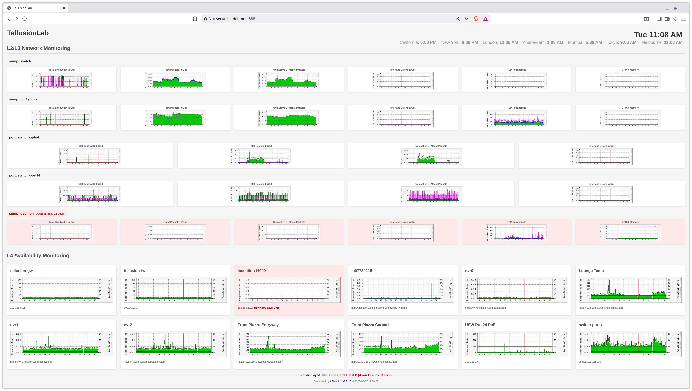

This layout is specifically designed for now commonly available 4K Ultra HD (3840x2160 16:9 2160p) screens. It's not uncommon to see modern NOCs with an array of these on the wall at eye height when someone is sitting down.
Instead of just having CCTV, you can now add some proper network telemetry and instrumentation, say with one YAML site file per screen, on the top row of screens.

Clicking on the heading associated with a set of ports will provide more L2/L3 information (depending on what's available via SNMP):

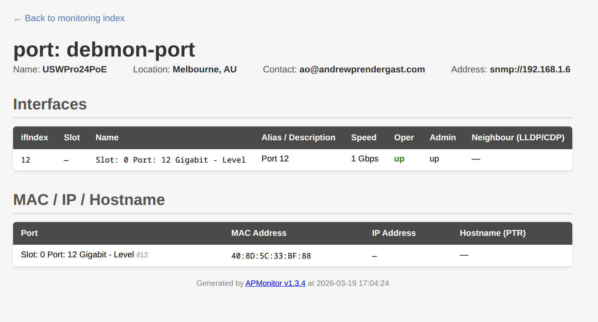

Note the NGINX/FastCGI combination means we don't need to keep a machine chewing on itself generating charts anymore - they are now generated on demand in near-realtime and extremely efficiently. The only I/O is the RRD files, which under the hood operate very much like the older MRTG text file format.

I chose RRD because it's a rather good frequency domain format for data warehousing of frequency domain sample data that's still compatible with Tier 1 NOCs.

If you want to work with this data directly, consider looking at <a href="https://librosa.org/doc/latest/index.html">LibROSA</a> from NYU's Fourier Lab team.
It is designed for working with Frequency Domain/Time Domain data and has a rather nifty spectrogram visualisation which might be relevant to you, amongst other things.
See the <a href="https://www.youtube.com/watch?v=MhOdbtPhbLU">launch lecture given at SciPy</a> for more information.

You might also want to look at <A href="https://nixtla.io">nixtla.io</a> or R's seasonal decomposition function called `stl`. Nixtla is more advanced and I've <a href="https://x.com/CompSciFutures/status/2033814554430607794?s=20">posted on 𝕏 about it here</a>.


# Design Philosophy &amp; Provenance

Once upon a time, I was well known in data center circles along Highway 101 in Silicon Valley for carrying in my back pocket a super lightweight pure C/libc cross-platform availability monitoring tool with no dependencies whatsoever called `APMonitor.c`. I'd graciously provide the source code to anyone who asked.

This is a rebuild of that project with enhanced features, starting with a Python prototype.

The design philosophy centers on simplicity and elegance: a single, unified source file containing the main execution flow for a 100% on-premises/LAN availability monitoring tool with guaranteed alerts and intelligent pacing.

Key Features:

- Near-realtime programming so heartbeats and alerts arrive when they say they are going to (+/- 10 secs)
- Multithreaded high-speed availability checking for PING, TCP, UDP, QUIC, HTTP(S), and SNMP resources
- SSL/TLS certificate checking and pinning so you can use self-signed certificates on-lan safely
- SNMP monitoring for network device interface bandwidth, I/O statistics, and TCP retransmit metrics
- Host performance monitoring (CPU, memory, disk I/O, swap, interrupts) per *System Performance Tuning* by Musumeci & Loukides (O'Reilly)
- Integration with Site24x7/PagerDuty heartbeat monitoring for high-availability second-opinion and failover alerting
- Integration with Slack and Pushover webhooks for notifications, plus standard email support
- Smart notification pacing: rapid alerts initially, then gradually decreasing frequency for extended outages
- Multi-site monitoring: for multiple single panes of glass, pass multiple config files on the command line; each runs concurrently as an independent subprocess with its own statefile, RRD database, and MRTG index
- Runs on everything from Raspberry Pi to enterprise systems
- Super accurate, high-frequency monitoring for real-time / embedded / heartbeat monitored environments
- Thread-safe, reentrant, and easily modifiable
- GPL 3.0 free open source always, so you know there are no backdoors

## Alternatives

If lightweight or realtime guarantees aren't important to you, and you want something more feature packed,
consider these on-prem alternatives:

- Uptime Kuma
- Statping
- UptimeRobot
- Paessler PRTG

APMonitor is simple, minimalist, elegant and lightweight and comes from a reliable line of heritage so you can spin
it up fast as a 2nd opinion monitoring tool with little more than a `make install`. If you want something more
sophisticated that's less focused on realtime programming or elegant simplicity, take a look at those very capable
alternatives.

# Relevance to the 12 Pillars of Information Security

NB: This tool is useful for implementing the second &amp; third pillars (Availability &amp; System Integrity)
from the 12 Pillars of Information Security, for Necessary, Sufficient & Complete Security:

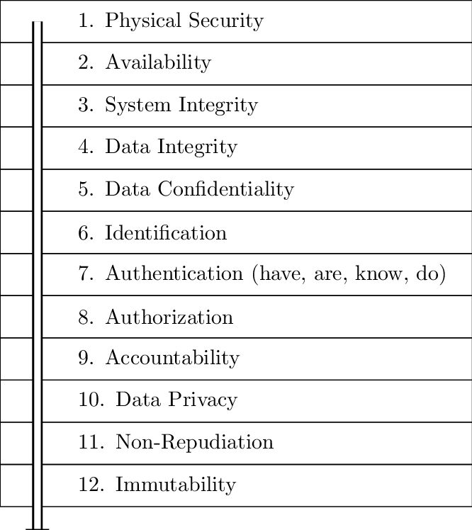

Also be mindful of the Attack Surface Kill-Switch Riddle:


To address this riddle, you should try to configure your machines & devices so that even if they are shutdown or halted in some way,
the Ethernet MAC address can still be read at Layer 2 so you can still receive alerts like this:

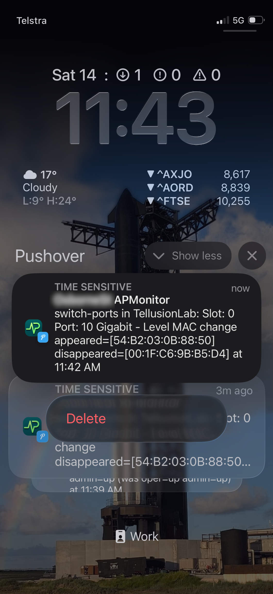

NB. Be careful that your definition of "Kill Switched" is well defined and tested before the need to make use of it comes time.
E.g., downing a port never works long term, it's merely advisory and something one does as they walk across the floor to unplug the cable from a switch.
Or is it, if you have this? YMMV.

See DOI [10.13140/RG.2.2.12609.84321](https://doi.org/10.13140/RG.2.2.12609.84321) and associated [LinkedIn post](https://www.linkedin.com/feed/update/urn:li:activity:7331490410197905409/) for more information on the Pillars of Information Security. It borrows from a piece of work I did back when #PARC needed me to work on #BookMasters in the digital era.

There is also some guidance on addressing the <a href="#recommended-configurations-for-addressing-the-first-pillar-physical-security">first pillar: Physical Security</a> in the recommended configurations below. 

# Recommended configuration for real-time environments

To put APMonitor into near-realtime mode so that it checks resources multiple times per second, use these global settings:

- Dial up threads with `-t 15` on the command line or `max_threads: 15` in the site config,
- set `max_retries` to `1` and
- dial down `max_try_secs` to `10` or `15` seconds

for real-time environments.

NB: If you are running `APMonitor.py` out of `systemd` with a default install, not specifying `max_threads` will default to `20`.

> [!WARNING]
> You need to make sure your configs have enough threads to finish in << 10 seconds to get near-realtime performance.
> Make sure `max_threads` & `max_try_secs` are configured appropriately. Also note that separate site configs are executed
> in parallel as subprocesses, so any down monitors in one site do not slow down monitors in other sites, regardless of settings.
>
> Note that the thing that usually slows down a site configuration are monitors that are down —
> you need enough threads to cover the maximum number of down monitors at any one time, on average.
> We say 'on average' because not all monitors are polled simultaneously after a decent period of
> a site config having been operational.

# Recommended configuration for securing IOT/OT/ICS networks

***IOT is not supposed to be a thing*** - to compensate **if you have an NVR**, you need L2 monitoring of MAC address changes for each OT/ICS device such as cameras, NVRs & Security Computer on your IOT network.

Use <a href="#switch-port-status--metrics--mac-change-monitor">Layer 2 Port MAC Change Monitoring</a>,
<a href="#https-monitor-with-certificate-pinning">Layer 4 HTTPS Self-Signed Certificate Pinning</a> and
<a href="#single-port-mac-pinning-monitor">Layer 2 MAC Address Pinning</a> so your network can't be tampered with.

To avoid <a href="https://x.com/search?q=%23VendorBackdoors&src=typed_query">vendor backdoors</a>, disable IPV6 and stop your IOT devices from communicating directly with The Internets excepting whitelisted addresses for purposes you specify (don't whitelist any cloud admin reverse shells).


# Recommended configuration of Site24x7 Heartbeat Monitor Thresholds for HA Availability Monitoring

You do need to configure Site24x7's Heartbeat Monitoring to achieve high-availability second opinion availability monitoring.

As an exemplar, for the following monitored resource:
```yaml
monitors:
  - type: http
    name: home-nas
    address: https://192.168.1.12/api/bump
    expect: "(C) COPYRIGHT 2005, Super NAS Storage Inc."
    ssl_fingerprint: a1b2c3d4e5f67890abcdef1234567890abcdef1234567890abcdef1234567890
    heartbeat_url: https://plus.site24x7.com/hb/your-unique-heartbeat-id/homenas
    heartbeat_every_n_secs: 300
```

Setup Site24x7 as follows:


This will send a heartbeat to [Site24x7](https://site24x7.com) every 5 minutes, and Site24x7 will drop an alarm whenever a heartbeat
doesn't arrive or arrives out of sequence +/- 1 minute (i.e., if the heartbeat doesn't arrive or is > 60 seconds out).
This ensures availability monitoring will always function, even when one of APMonitor or Site24x7 is down.

This also means you don't need to expose internal LAN network resources to The Internets.

APMonitor's near-realtime capabilities will deliver heartbeats +/- 10 secs, so if you want high-precision alerts
drop an alarm if a heartbeat does not arrive bang on 5 minutes apart +/- 10 secs.

To see the accuracy, configure Site24x7 as follows:

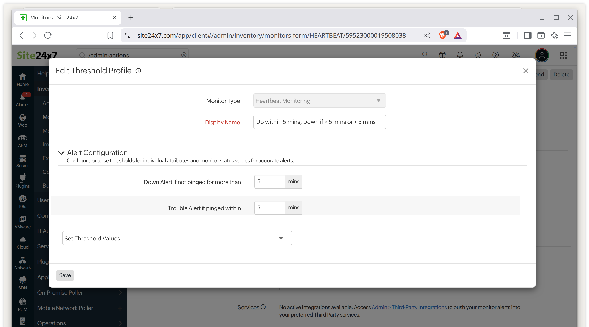

Site24x7 will record the error in their dashboard for anything that is more than +/- 1000 ms out,
so you can keep a record of how accurate the near-realtime heartbeat timing is.

See Site24x7 docs for more info:
- [Heartbeat Monitoring](https://www.site24x7.com/help/heartbeat/)
- [Thresholds configuration](https://www.site24x7.com/help/admin/configuration-profiles/threshold-and-availability/server-monitor.html)

NB: "+/- 10 secs" means your errors should be measurable in 10ths of a minute. Once Mercator Queues are added, this will
drop down to "+/- 1 sec" or possibly "+/- 100 ms", depending on how well Python performs with high-speed realtime
programming. A workaround in the meantime is to make sure your number of threads is equal to the number of monitored
resources - something that is not necessarily practical or required in most settings.


# Recommended configuration for 'Hands-Off' alarm notification pacing

If you want to avoid the need to connect to the monitoring server to hush alarms as they happen and ensure you receive
UP notifications as soon as things return to normal, you might also want to consider alarm notification pacing, so that
recently down resources generate more frequent messages, whilst long outages are notified less frequently. To enable:

- Set `notify_every_n_secs` to `3600` seconds (i.e., 1 hour), and
- Set `after_every_n_notifications` to `8`,

which will slow alarms down to one per hour after 8 notifications.

An alternate config for monitored resources that have long outages is as follows:

- Set `notify_every_n_secs` to `43200` (i.e., 12 hours), and
- Set `after_every_n_notifications` to `6`,

which will slow alarms down to one every 12 hours after 6 notifications, which means after a few days you will only get at most one alarm whilst asleep.

To see how the alarm pacing will accelerate then subsequently delay notifications, use the example calculations spreadsheet in  [20151122 Reminder Timing with Quadratic Bezier Curve.xlsx](devnotes/20151122%20Reminder%20Timing%20with%20Quadratic%20Bezier%20Curve.xlsx) to experiment with various configuration scenarios:

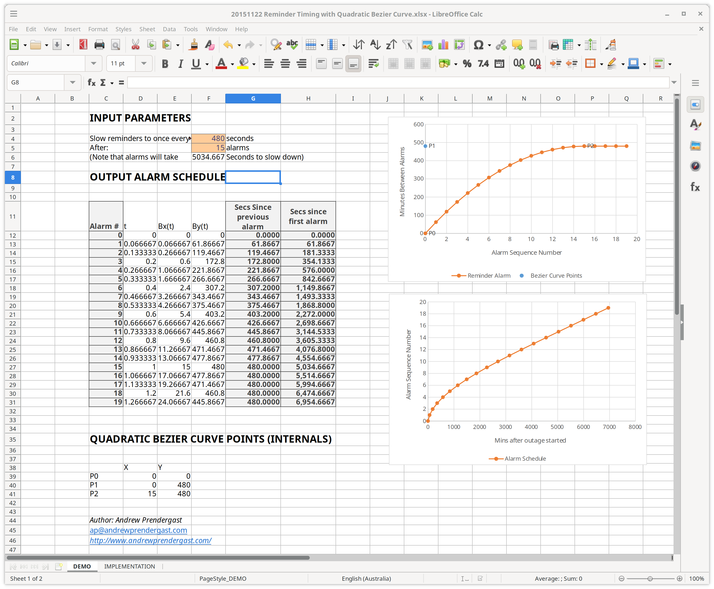

Note that alarm pacing can be set at a global level in the `site:` config, and is overridden when set at a per monitored resource level in the `monitors:` section of the config.

# Recommended configuration for running multiple site configurations & panes of glass

APMonitor supports monitoring multiple sites from a single service instance by passing multiple configuration files on the command line. Each config file is processed as an independent site with its own statefile, RRD database, and MRTG index page under `/var/www/html/mrtg/<site-name>/`.

This is useful for running multiple single panes of glass out of one monitoring box.

If you are running multiple single panes of glass out of one computer, consider buying a <a href="https://www.ebay.com/sch/i.html?_nkw=usb+air+mouse&_sacat=51086&_from=R40&_trksid=p2334524.m570.l1313&_odkw=air+mouse&_osacat=51086&mkcid=1&mkrid=711-53200-19255-0&siteid=0&campid=5339147142&customid=&toolid=10001&mkevt=1">USB Air Mouse or three</a> till you find one that works well for you, like this one:


## How it works

When multiple config files are specified, APMonitor spawns one subprocess per config file and runs them concurrently, joining all subprocesses before exiting. Each subprocess:

- Derives its own statefile automatically from the config filename under `/var/tmp/APMonitor/` (e.g. `apmonitor-config.yaml` → `/var/tmp/APMonitor/apmonitor-config.statefile.json`)
- Writes its MRTG index and detail pages to `/var/www/html/mrtg/<site-name>/` where `<site-name>` is derived from `site.name` in the config
- Maintains completely independent monitoring state, notification history, and RRD data

## Systemd service configuration

Edit `/etc/systemd/system/apmonitor.service` to list all config files on the `ExecStart` line:
```
[Unit]
Description=APMonitor Network Resource Monitor
After=network.target

[Service]
Type=simple
ExecStart=/bin/bash -c 'while true; do /usr/local/bin/APMonitor.py -t 20 -vv /usr/local/etc/apmonitor-config.yaml /usr/local/etc/site2-config.yaml /usr/local/etc/site3-config.yaml --generate-mrtg-config; sleep 5; done'
Restart=always
RestartSec=5
User=monitoring
StandardOutput=journal
StandardError=journal

[Install]
WantedBy=multi-user.target
```

It is useful to keep a commented-out single-site `ExecStart` line for quick debugging:
```
#ExecStart=/bin/bash -c 'while true; do /usr/local/bin/APMonitor.py -vv /usr/local/etc/apmonitor-config.yaml --generate-mrtg-config; sleep 5; done'
```

After editing the service file, reload systemd and restart the service:
```bash
sudo systemctl daemon-reload
sudo systemctl restart apmonitor.service
```

Note that `make install` will preserve a customized `ExecStart` line on subsequent installs — it only writes the default if no service file exists yet.

## Statefiles and MRTG output

Each config file produces its own set of derived files. Statefiles are stored under `/var/tmp/APMonitor/` (mode 755, no www-data access) and MRTG output is written into a per-site subdirectory of the MRTG working directory:

| Config file | Statefile | MRTG index |
|---|---|---|
| `apmonitor-config.yaml` | `/var/tmp/APMonitor/apmonitor-config.statefile.json` | `http://<host>:888/mrtg/HomeLab/` |
| `site2-config.yaml` | `/var/tmp/APMonitor/site2-config.statefile.json` | `http://<host>:888/mrtg/TellusionLab/` |
| `site3-config.yaml` | `/var/tmp/APMonitor/site3-config.statefile.json` | `http://<host>:888/mrtg/OfficeLab/` |

The MRTG subdirectory name comes from `site.name` in each config file (sanitised to a filesystem-safe string), not from the config filename. The statefile name is always derived from the config filename stem.

## Default state file location

On Unix-like systems, APMonitor stores all statefiles under `/var/tmp/APMonitor/`:

- Directory is created automatically with mode `755` (no group write — www-data is explicitly excluded)
- Persists across reboots (unlike `/tmp`)
- All sibling files (`.json`, `.json.new`, `.json.old`, `.mrtg.cfg`, `.rrd/`) live in this directory

The `-s/--statefile` flag overrides this for single-config invocations. It is not valid when multiple config files are specified.

## Migrating statefiles from older versions

If upgrading from a version that stored statefiles in `/var/tmp/` directly, run:
```bash
sudo make migrate
```

This performs a two-phase migration:

1. Renames `apmonitor-statefile.*` → `apmonitor-config.statefile.*` in `/var/tmp/` (legacy name fix)
2. Moves all `apmonitor-*.statefile.*` files and `.rrd` directories from `/var/tmp/` into `/var/tmp/APMonitor/`

The service is stopped before migration and restarted afterwards. If a destination file already exists it is skipped with a warning rather than overwritten.

## Threading with multiple sites

The `-t` flag sets the number of monitor-checking threads **per site**, not globally. With three sites and `-t 20`, up to 60 threads may be active concurrently across all subprocesses. Size `-t` based on the largest single site's monitor count rather than the total across all sites.

## Notes

- `-s/--statefile` is not valid when multiple config files are specified — each site always derives its own statefile automatically from the config filename.
- `make install` writes a default single-site `ExecStart`. Edit it manually after installation to add additional config files — subsequent `make install` runs will preserve your customized `ExecStart`.
- `make test-config` only tests the default config at `$(CONFIG_DIR)/apmonitor-config.yaml`. Test additional configs directly: `APMonitor.py --test-config /usr/local/etc/site2-config.yaml`.

# Recommended configuration for SNMP monitoring on Debian Linux

To enable SNMP monitoring on a Debian host so that APMonitor can poll it, install and configure `snmpd` with a read-only community string restricted to your APMonitor machine.

## Install
```bash
sudo apt install snmpd snmp
```

## Configure `/etc/snmp/snmpd.conf`

Replace the default config with the following minimal read-only configuration:
```
# Listen on all interfaces (lock to a specific IP if preferred)
agentAddress udp:161

# Read-only community, restricted to your APMonitor host only
# Replace 192.168.1.50 with the IP of your APMonitor machine
rocommunity YourCommunityString 192.168.1.50

# Optional: identify the device
sysLocation "Server Room Rack 3"
sysContact "admin@example.com"
sysName "my-debian-host"
```

## Enable and restart
```bash
sudo systemctl restart snmpd
sudo systemctl enable snmpd
```

## Firewall

If the host runs a firewall, allow UDP port 161 from your APMonitor machine only:
```bash
# ufw
sudo ufw allow from 192.168.1.50 to any port 161 proto udp

# iptables
sudo iptables -A INPUT -s 192.168.1.50 -p udp --dport 161 -j ACCEPT
```

## Test from your APMonitor host
```bash
snmpwalk -v 2c -c YourCommunityString 192.168.1.x
```

## Notes

- `rocommunity` is the read-only directive — the absence of any `rwcommunity` line is what keeps access strictly read-only.
- Locking the source IP to your APMonitor machine is the primary access control on a LAN. Do not use `default` or `0.0.0.0/0` unless there is no alternative.
- Change `YourCommunityString` to something non-obvious — `public` is the first string any scanner tries.
- SNMPv3 with authentication and encryption is the correct choice for hosts on networks you do not fully trust. For a closed LAN behind a firewall, SNMPv2c with a non-default community string and source IP restriction is workable.

## APMonitor configuration

Once `snmpd` is running, add a `ports` monitor pointing at the host:
```yaml
- type: ports
  name: my-debian-ports
  address: "snmp://192.168.1.x"
  community: "YourCommunityString"
  check_every_n_secs: 300
```

For host performance monitoring (CPU, memory, disk I/O), use `type: host` instead:
```yaml
- type: host
  name: my-debian-host
  address: "snmp://192.168.1.x"
  community: "YourCommunityString"
  check_every_n_secs: 300
```

# Recommended configurations for addressing the first pillar: Physical Security

Using `APMonitor.py` to address Availability & System Integrity can help with maintaining Physical Security. Here are some tips from the trenches on keeping server equipment secure. I like to call this "Physical Cyber Defence".

## Removing SIM Cards from Inner Range T4000 remote monitored alarm devices

Inner Range has become a dominating force in access control and alarm systems in IDCs, offices and high-end homes around the western world in recent times. 
What installers don't tell you is that they are full of vendor backdoors. The best way to address this is to remove it's access to your monitoring station via 3G/4G via The Internets entirely and put it into your LAN so it goes through normal governance, risk and compliance as per all other devices.

NB: Know this: in addition to vendor backdoors, every remote monitored alarm is a reverse shell. That's just how it is.

Steps to securing your T4000 and Inner Range devices from Vendor Backdoors:

1. Block all communications with Inner Range directly fromm your IOT network:

    You do not want your T4000, Inception or Integriti devices communicating with the <a href="https://www.skytunnel.com.au/info">default IPs associated with Inner Range which are published here</a>. 
    These servers act as a reverse shell and are the primary source of <a href="https://x.com/search?q=VendorBackdoors&src=typed_query">Vendor Backdoor</a> access to your security computer.

    This list is not always available so the last known list of SkyTunnel servers are: 
    1. 20.188.210.209
    2. 23.101.229.107
    3. 52.189.230.114
    4. 137.116.114.112

    A backup of the page is available via <a href="https://web.archive.org/web/20251112025012/https://www.skytunnel.com.au/info">WayBack Machine</a>


2. Remove the SIMs from your T4000 so all traffic routes through your availability monitored network:

    A boxed T4000 unit:

    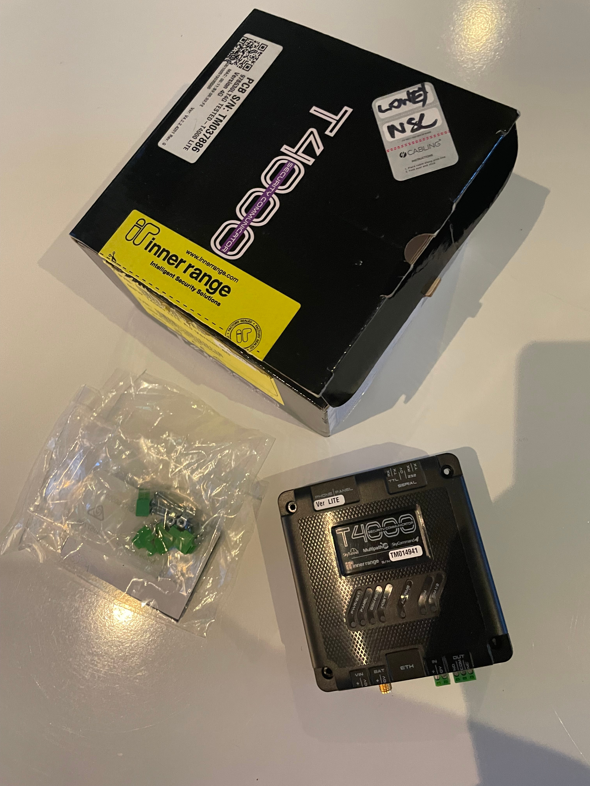

    A T4000 unit with it's SIMs removed:

    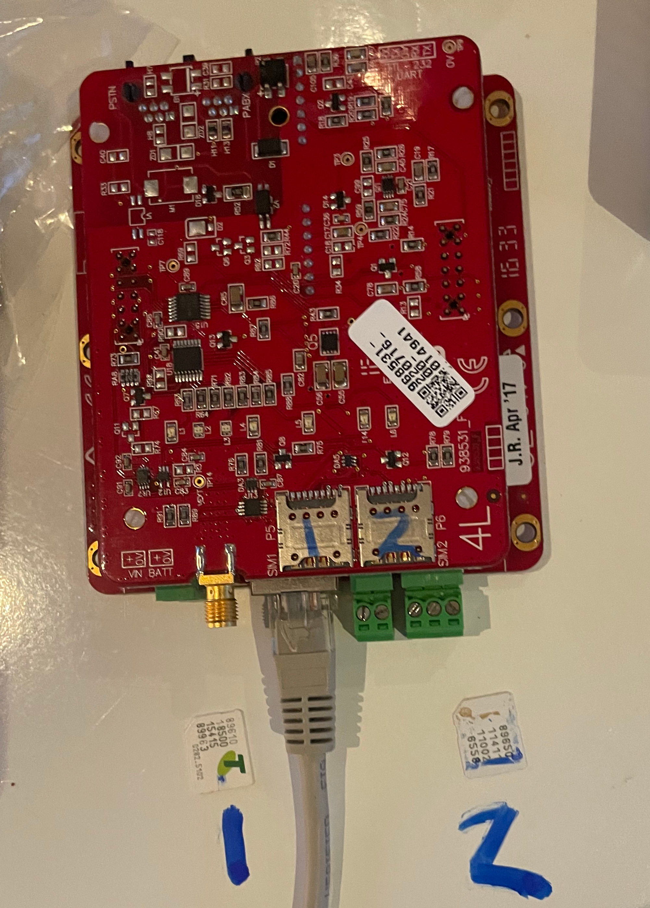

    This will stop it talking to home base with reverse shells and vendor backdoors.


3. Plugin the GigE adapter from your IOT network to the T4000 (grey cable in picture above).

NB: Removing the SIMs breaks the circuit that allows the device to communicate wirelesley.

NNB: This is a valid enterprise grade T4000 configuration.

## Using Chinese made pin entry locks with protective covers

All locks can be picked, and all high security registered key systems can have additional keys cut by the police
or anyone persuasive enough (read: vendor backdoors & gun/$$$ respectively) to get a locksmith to make spare key.
I've seen it happen to server rooms several times over the years.

To get around the problem, we combine normal physical locks with <a href="https://www.ebay.com/sch/159907/i.html?_nkw=electronic+pin+door+lock&_salic=45&LH_LocatedIn=1&mkcid=1&mkrid=711-53200-19255-0&siteid=0&campid=5339147142&customid=&toolid=10001&mkevt=1">Chinese made electronic pin locks from eBay</a>,
but they all suffer the same issue of being circumventable using a credit card or knife, as this video demonstrates how easy it is:

<br /><br />

To address the problem, we get a metal fab to manufacture a protective plate to cover the lock so it can't be so easily circumvented:


Here is the same video for a lock with a plate installed - can't open it now:

<br /><br />

And here are the basic plans to get a metal fab to create a Protective Striker Cover Plate for you: 

[](physical-security/Striker-Plate-Cover-CAD-design.pdf)

For maximum security, try to customize the lip that covers the front of the door to be as wide as possible without 
bumping into the actual lock (marked as 35.0 and 19.3 in the CAD diagram).

You want to prevent the possibility of someone getting anything under the plate itself by butressing the plate up against
the lock as much as is practically possible. My first few attempts at this were unsuccsesful before working out this is
the trick that really does make this solution work.

If I encounter a failure again, I'm going to do a round cutout in the plate for the doorknob itself. Do let me know how you go with this solution. 

## Using a span port + tcpdump to analyse IOT traffic for security devices

Sometimes we just want to know what a device or an IOT network is communicating with on The Internets. Here is how it's done.
First you need to slurp up some packets using tcpdump + spans, then analyse it using tshark and sed/awk/grep, as follows.

Steps to monitor TCP/IP connectivity by a device:

1. Setup your IOT switch so that all traffic over the uplink port is spanned onto a secondary port (all managed switches do this - look at the manual on how to setup a span).

    NB: `APMonitor.py` may take this input as a live feed in future, so get used to working with spans and taps.

    Label your SPAN port correctly as "PROMISC" so you don't use it as a normal port then leave it setup, eg:<br /><br />

    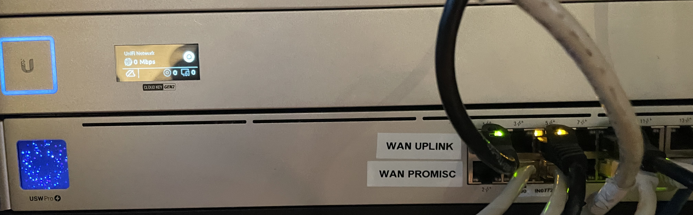<br /><br />

    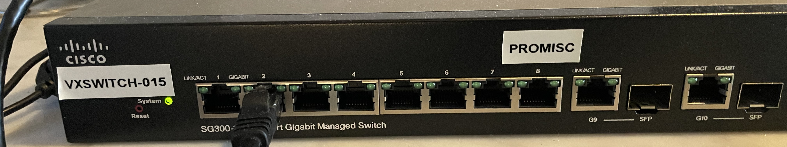<br />


2. Plug a linux box into the span port and dump the traffic on the port using `tcpdump` into daily `.pcap` files:

    ```
    apt install tcpdump wireshark tshark
    tcpdump -i eno1 \
        -nn -e -v -t --print --immediate-mode -l \
        -G 86400 -Z ap -w %Y%m%d-%H%M%S-eno1.pcap -W 90 -C 10240
    ```

3. Run this script over the `.pcap` files:

    ```
    ls *.pcap | \
    xargs -I {} tshark -r {} -d tcp.port==40844,http -d tcp.port==40844,tls -Y '(eth.addr==00:11:b9:06:93:fe or eth.addr==00:11:b9:09:04:ff) and (ip or ipv6)' -T fields -e eth.src -e eth.dst -e ip.version -e ip.proto -e ip.src -e ip.dst -e tcp.srcport -e tcp.dstport -e udp.srcport -e udp.dstport -e http.host -e tls.handshake.extensions_server_name > /tmp/tshark_output.txt
    
    awk -F'\t' '
    # Pass 1: Build lookup table
    NR==FNR {
        ip = ($1 == "00:11:b9:06:93:fe" || $1 == "00:11:b9:09:04:ff") ? $6 : $5;
        http_host = $11;
        tls_sni = $12;
        if ((http_host || tls_sni) && !app_hosts[ip]) {
            app_hosts[ip] = http_host ? http_host : tls_sni;
            print "added: " ip " = " app_hosts[ip] > "/dev/stderr";
        }
        next;
    }
    # Pass 2: Use lookup table
    {
        mac = ($1 == "00:11:b9:06:93:fe" || $1 == "00:11:b9:09:04:ff") ? $1 : $2;
        ip = ($1 == "00:11:b9:06:93:fe" || $1 == "00:11:b9:09:04:ff") ? $6 : $5;
        proto = ($4 == "6") ? "tcp" : ($4 == "17") ? "udp" : $4;
        src_port = $7 ? $7 : $9;
        dst_port = $8 ? $8 : $10;
        remote_port = ($1 == "00:11:b9:06:93:fe" || $1 == "00:11:b9:09:04:ff") ? dst_port : src_port;
        app_host = (app_hosts[ip] ? app_hosts[ip] : "-");
        if (remote_port) print mac "\t" ip "\t" remote_port "/" proto "\t" app_host;
    }
    ' /tmp/tshark_output.txt /tmp/tshark_output.txt | \
    sort | uniq -c | \
    awk '{print $1 "\t" $2 "\t" $3 "\t" $4 "\t" $5}' | \
    while IFS=$'\t' read count mac ip port_proto app_host; do
        hostname=$(host $ip 2>/dev/null | awk '{print $NF}' | sed 's/\.$//')
        port=$(echo $port_proto | cut -d/ -f1)
        proto=$(echo $port_proto | cut -d/ -f2)
        service=$(getent services "$port/$proto" 2>/dev/null | awk '{print $1}')
        echo "$count $mac $ip $port_proto ${service:-unknown} $app_host $hostname"
    done && rm /tmp/tshark_output.txt
    ```
   
    Which for a T4000 should generate output such as the following:

    ```
    added: 142.251.2.109 = smtp.gmail.com
    added: 74.125.137.108 = smtp.gmail.com
    added: 74.125.137.109 = smtp.gmail.com
    added: 142.251.2.108 = smtp.gmail.com
    added: 142.250.101.108 = smtp.gmail.com
    added: 142.250.141.108 = smtp.gmail.com
    added: 142.250.141.109 = smtp.gmail.com
    added: 142.250.101.109 = smtp.gmail.com
    added: 212.227.81.55 = ipv4.connman.net
    added: 172.67.221.214 = irmsg.vizdynamics.com
    added: 104.21.67.116 = irmsg.vizdynamics.com
    201 00:11:b9:06:93:fe 137.116.114.112 40844/tcp unknown - 3(NXDOMAIN)
    16 00:11:b9:06:93:fe 192.168.68.1 67/udp bootps - 3(NXDOMAIN)
    5382 00:11:b9:06:93:fe 23.101.229.107 40844/tcp unknown - 3(NXDOMAIN)
    11 00:11:b9:06:93:fe 255.255.255.255 67/udp bootps - 3(NXDOMAIN)
    2 00:11:b9:06:93:fe 9.9.9.9 53/udp domain - dns9.quad9.net
    12 00:11:b9:09:04:ff 104.21.67.116 443/tcp https irmsg.vizdynamics.com 3(NXDOMAIN)
    16 00:11:b9:09:04:ff 115.70.68.136 123/udp ntp - 115-70-68-136.ip4.exetel.com.au
    12 00:11:b9:09:04:ff 119.18.6.37 123/udp ntp - smtp.juneks.com.au
    31 00:11:b9:09:04:ff 129.250.35.251 123/udp ntp - y.ns.gin.ntt.net
    3 00:11:b9:09:04:ff 129.250.35.251,192.168.68.204 40756/1,17 unknown - 3(NXDOMAIN)
    18 00:11:b9:09:04:ff 13.55.50.68 123/udp ntp - ec2-13-55-50-68.ap-southeast-2.compute.amazonaws.com
    46700 00:11:b9:09:04:ff 137.116.114.112 40844/tcp unknown - 3(NXDOMAIN)
    34 00:11:b9:09:04:ff 139.180.160.82 123/udp ntp - syd.clearnet.pw
    6 00:11:b9:09:04:ff 139.99.135.247 123/udp ntp - vps-b7eaeed7.vps.ovh.ca
    76 00:11:b9:09:04:ff 142.250.101.108 587/tcp submission smtp.gmail.com dz-in-f108.1e100.net
    230 00:11:b9:09:04:ff 142.250.101.109 587/tcp submission smtp.gmail.com dz-in-f109.1e100.net
    2065 00:11:b9:09:04:ff 142.250.141.108 587/tcp submission smtp.gmail.com dd-in-f108.1e100.net
    1500 00:11:b9:09:04:ff 142.250.141.109 587/tcp submission smtp.gmail.com dd-in-f109.1e100.net
    380 00:11:b9:09:04:ff 142.251.2.108 587/tcp submission smtp.gmail.com dl-in-f108.1e100.net
    1600 00:11:b9:09:04:ff 142.251.2.109 587/tcp submission smtp.gmail.com dl-in-f109.1e100.net
    15719 00:11:b9:09:04:ff 149.112.112.112 53/udp domain - dns.quad9.net
    54 00:11:b9:09:04:ff 150.107.75.115 123/udp ntp - time.pickworth.net
    16 00:11:b9:09:04:ff 159.196.178.7 123/udp ntp - 3(NXDOMAIN)
    37 00:11:b9:09:04:ff 159.196.3.239 123/udp ntp - 159-196-3-239.9fc403.mel.nbn.aussiebb.net
    16 00:11:b9:09:04:ff 159.196.45.149 123/udp ntp - record
    20 00:11:b9:09:04:ff 162.159.200.1 123/udp ntp - time.cloudflare.com
    24 00:11:b9:09:04:ff 162.159.200.123 123/udp ntp - time.cloudflare.com
    32 00:11:b9:09:04:ff 167.179.162.50 123/udp ntp - 167-179-162-50.a7b3a2.bne.nbn.aussiebb.net
    16 00:11:b9:09:04:ff 172.105.179.71 123/udp ntp - 172-105-179-71.ip.linodeusercontent.com
    100218 00:11:b9:09:04:ff 172.67.221.214 443/tcp https irmsg.vizdynamics.com 3(NXDOMAIN)
    20826 00:11:b9:09:04:ff 172.67.221.214 80/tcp http irmsg.vizdynamics.com 3(NXDOMAIN)
    6 00:11:b9:09:04:ff 180.150.8.191 123/udp ntp - bitburger.simonrumble.com
    11 00:11:b9:09:04:ff 192.168.68.1 123/udp ntp - 3(NXDOMAIN)
    1 00:11:b9:09:04:ff 192.168.68.1,192.168.68.203 34051/1,17 unknown - 3(NXDOMAIN)
    1 00:11:b9:09:04:ff 192.168.68.1,192.168.68.203 35951/1,17 unknown - 3(NXDOMAIN)
    1 00:11:b9:09:04:ff 192.168.68.1,192.168.68.203 36204/1,17 unknown - 3(NXDOMAIN)
    1 00:11:b9:09:04:ff 192.168.68.1,192.168.68.203 38036/1,17 unknown - 3(NXDOMAIN)
    1 00:11:b9:09:04:ff 192.168.68.1,192.168.68.203 40942/1,17 unknown - 3(NXDOMAIN)
    1 00:11:b9:09:04:ff 192.168.68.1,192.168.68.203 44065/1,17 unknown - 3(NXDOMAIN)
    1 00:11:b9:09:04:ff 192.168.68.1,192.168.68.203 48603/1,17 unknown - 3(NXDOMAIN)
    1 00:11:b9:09:04:ff 192.168.68.1,192.168.68.203 55896/1,17 unknown - 3(NXDOMAIN)
    1 00:11:b9:09:04:ff 192.168.68.1,192.168.68.204 42573/1,17 unknown - 3(NXDOMAIN)
    1 00:11:b9:09:04:ff 192.168.68.1,192.168.68.204 52984/1,17 unknown - 3(NXDOMAIN)
    1 00:11:b9:09:04:ff 192.168.68.1,192.168.68.204 57294/1,17 unknown - 3(NXDOMAIN)
    31 00:11:b9:09:04:ff 192.168.68.1 67/udp bootps - 3(NXDOMAIN)
    6 00:11:b9:09:04:ff 194.195.249.28 123/udp ntp - ap-southeast-2.clearnet.pw
    50 00:11:b9:09:04:ff 203.12.5.225 123/udp ntp - my.blockbluemedia.com
    24 00:11:b9:09:04:ff 203.14.0.250 123/udp ntp - tic.ntp.telstra.net
    50 00:11:b9:09:04:ff 212.227.81.55 80/tcp http ipv4.connman.net ipv4.connman.net
    48 00:11:b9:09:04:ff 220.158.215.20 123/udp ntp - 220-158-215-20.broadband.telesmart.co.nz
    99 00:11:b9:09:04:ff 224.0.0.251 5353/udp mdns - mdns.mcast.net
    6187 00:11:b9:09:04:ff 23.101.229.107 40844/tcp unknown - 3(NXDOMAIN)
    1 00:11:b9:09:04:ff 239.255.255.250 1902/udp unknown - 3(NXDOMAIN)
    38 00:11:b9:09:04:ff 255.255.255.255 67/udp bootps - 3(NXDOMAIN)
    48 00:11:b9:09:04:ff 27.124.125.250 123/udp ntp - ntp1.ds.network
    6 00:11:b9:09:04:ff 45.124.53.221 123/udp ntp - ns1.adelaidewebsites.com.au
    8 00:11:b9:09:04:ff 67.219.100.202 123/udp ntp - mel.clearnet.pw
    494 00:11:b9:09:04:ff 74.125.137.108 587/tcp submission smtp.gmail.com dy-in-f108.1e100.net
    643 00:11:b9:09:04:ff 74.125.137.109 587/tcp submission smtp.gmail.com dy-in-f109.1e100.net
    70 00:11:b9:09:04:ff 82.165.8.211 80/tcp http - 3(NXDOMAIN)
    15739 00:11:b9:09:04:ff 9.9.9.9 53/udp domain - dns9.quad9.net
    ```

5. Inspect the list and go through each host/protocol and build a whitelist of what you want to allow.


## Recommended tools for finding rogue cabling, RF and bugs

We use these - the "<a href="https://www.fluke.com/en-au/product/network-cable-testers/copper/pro3000kit">Fluke Networks Pro3000(TM) Tone Generator and Probe Kit</a>", aka a 'Krone Fluke' not to be confused with a Telco DC 'Butt Phone':


You will probably also want to pickup an inline GigE-to-GigE Female-to-Female inline Cat5/Cat6 coupler, for example the <a href="https://www.startech.com/en-eu/cables/in-cat6a-coupler-s1">IN-CAT6A-COUPLER-S1</a> from StarTech. BlackBox should have something similar.

You do need a Network Engineer to train you how to use one of these, but basically:

```
BEEPING TONE:    You are close
WHIRRING SOUND:  That's 50/60hz AC or DC/microwave energy/electricity
CLICKING:        That's data
```

Here is a <a href="https://x.com/CompSciFutures/status/2035128367704596572?s=20">demo of it in action</a> - see if you can spot the CLICKING from the WHIRRING. Make a map of your environment early, like an Electricial Engineer would do wiring architecture diagrams submittable to council for building approval, then compare your environment to the architecture diagrams often (but not frequently).

NB. USB-C/Firewire does not belong in data centers, because it hasn't been treated for Tempest, and HDMI does not belong in Tier-1 data centers, because of HDMI-ARC/CEC.


## Recommended PIR Sensors that are for Computer Science to use

There are only two PIR sensors on the market that have anywhere near the level of controls and quality
that could be used in a computer science based environment when we have things like Physical Security requirements
that need to be compliant with the needs of Regulated Industry and Tier-1 environents that have significant
problems being constantly targeted by State Actors.

You have two options:

- An array of zero-config ceiling mounted <a href="https://www.manualslib.com/products/Paradox-Paradome-Dg467-9092336.html">Paradox DG467 360' PIR</a> sensors ([Paradox-DG467-Manual.pdf](physical-security/Paradox-DG467-Manual.pdf)).
- Carefully tuned sensor fused <a href="https://www.manualslib.com/manual/1444971/Paradox-Nv75mw.html">Paradox NV75MW room corner PIR</a> sensors ([Paradox-NV75MW-Manual.pdf](physical-security/Paradox-NV75MW-Manual.pdf)).

Keeping these on the market are a constant source of problems. You may have to order 100 or 1000 units
to get the ones you want and know they are authentic. Talk directly to <a href="https://www.paradox.com/web/contact-us/">the manufacturer</a>
if you have problems.

All the other sensors aren't suitably equipped with tamper detection/resistance, and are easily 
crept past by any Security Alarm Installer worth more than 2c. It's quite extrordinary getting a demo
from a Security Installer that can dance and shuffle through an array of normal PIR sensors and not let
one off - they do it on site quite regularly when setting up systems as it's easier than pressing
buttons on a control pad that might be several rooms away.

When getting sensors installed for computer science / electrical engineering based environments:

- Understand that all security equipment that is electronic falls under IEEE, in which we are significantly more 
    senior at a global level than any technician or state based police laws prohibiting our access to their end
    user documentation or installation thereof.
    We build the fabs and train the engineers that design and manufacture their equipment.

- Always take posession of the instruction manuals for all the equipment from the installers that come with the equipment.

- Always leave the PIR lights ON. That way we can constantly check they are working ourselves when we are
    passing through the environments that we are responsible for or manage.

- Learn to do regular Walk Tests using both visual inspection of the PIR lights, and with a laptop in hand. This is not
  always easy, as we like to keep Security Computer off all networks if possible. Just use the lights most times.
  If police or governments get the chance, they will de-tune a sensor we've setup - always. I've seen it before, lots. 

- Our industry associations are <a href="https://www.ieee.org/">IEEE</a> and <a href="https://acm.org/">ACM</a>:
    make sure your local state police and the security installer's industry
    association is registered a member of both as an "individual organisation". As a collective unit they
    represent collectively no more than a single member, so we have somewhere to complain to when things 
    are being made difficult or shenanigans are afoot with backdoors and system tampering/interference.

- Come to terms with this: our networks, computers, their code and our surveillance are a target by these
    state actors to put in backdoors anywhere and all over the world. Make sure they are always suitably
    supervised when installers or police are onsite around any of our computers, data centers or
    networking equipment.

- We are global and permanent in scale - they are hyperlocal and usually temporary. The systems we build may last
    many decades; they will probably be out of a job next week or when the next election happens. Do not put
    too much trust or faith that local government or police will do the right thing or maintain a consistent
    performance level that is in accordance with our Industry Association rules and code of conduct.
  
    - CS: ACM's are <a href="https://www.acm.org/about-acm/acm-policies-and-procedures">available here</a>.

    - EE: IEEE are a bit bigger, but <a href="https://www.ieee.org/content/dam/ieee-org/ieee/web/org/about/corporate/ieee-policies.pdf">start here</a> if you want the detail.

- These people are not considered a "User" of our systems, so do not let them interact directly with them or
    you may invalidate their engineering.

- Be wary of security advice given to us by governments and police - assume some possibility they are usually corrupt criminals working with intelligence agencies.

The bigger and more global your relevance, the more of a problem the abovementioned is relevant and important to you. 

Know that "On the floor is always on the floor, you dickhead [sic]" is actually a thing in IDCs, and we expect to see 3 layers of physical security to get on the floor. (PS: And "a cage is ALWAYS just a flex" + "Telephony next to compute is not a valid configuration in any known universe" + if you see an unmanned data center, is that a problem for them or a problem statement they are saying to you?).

Also note: To get these setup properly, you might find a situation where CS & EE people are going to need to talk to
each other. CS people (that do Discrete Mathematics and deal in systems where EVERYTHING is 'abstract') and
a real EE (whom do Real Mathematics and deal in systems where EVERYTHING is actually real physics and hard sciences)
are not supposed to talk too much as our mathematical tutelage is a little incompatible in places.
Just stay on topic and try to combine forces without talking to each other too much about "why", just "what & how".

Those are the people that are supposed to be quite measured about what they can and can't say to each other about their respective
fields, NOT governments/police vs. us.


### Setting up the Paradox NV75MW room corner PIR

Read the installers manual from start to finish. Have a CS EE around that has done some basic AI/ML tuition such that they
may have some sense of adversarial optimisation, sensor fusion, distance metrics and/or false positives & negatives 
at least at a theoretical level.

This sensor uses Electronic Engineering to fuse two input data sources (infared + microwave) to get a more
accurate and less sneakable/sneak-past environment. Do some robotics at Stanford to really understand why,
or think of it like this: two is always better than one. The vendor calls this "seetrue".
Do not overlap beams with these sensors or you may get false negatives caused by destructive cancellation/interference or
false positives cause by constructive cancellation/interference.

These are the DIP switch settings to use (I think - I haven't checked lately YMMY). 
This enables proper sensor fusion and tamper detection.
Read the manual and understand why:

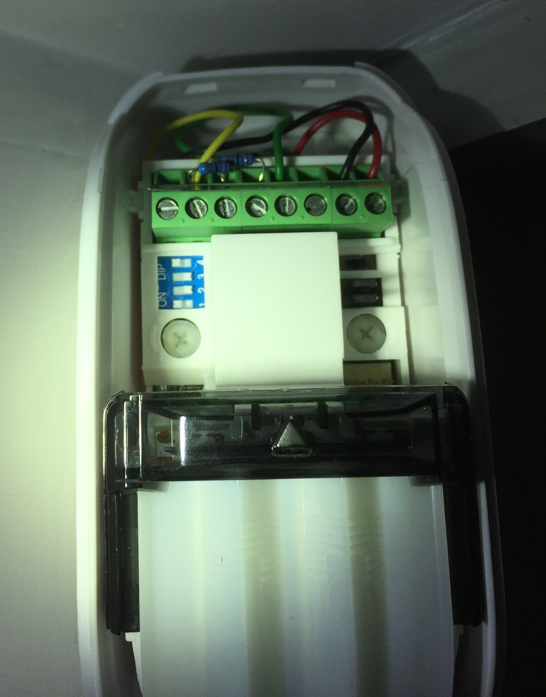

```
1: ON  (LED = ON)
2: OFF (EDGE DETECT=DUAL SENSOR)
3: OFF (PET MODE=OFF/NO PETS + SEETRUE=ON)
4: ON  (SEETRUE=SOFT? YMMV)
```

Your installer is not going to be able to install this out of the box as the wiring 
is nonstandard for them, strict for us and requires an EE to interpret the manuals.
If they have problems, hand them this picture:

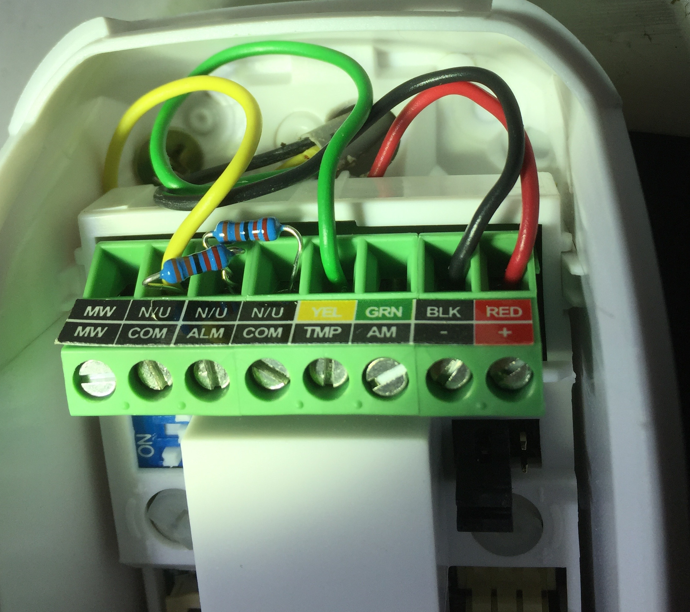

(NB: I think this is the correct photo - it has been a while. Please confirm if you set one of these up)

Once they have a basic install done and you can walk past and see the PIR light go on, take control of the sensor and
tell the Installer to leave, then carefully adjust the DIP switches and sensor fusion rotary trimpots to get both
microwave + infrared working (tip: with the controls you have, try to configure the range on each separately, then
turn on fusion - this is not immediately possible at first glance after reading the manual, but it is if you
think about it). You may need to get the installer to show you the basics of "how do I tune the infrared distance 
using the trimpot and the sensor light?" first before solving the rest of the problem.

Also try to document your settings because these things do get changed on these sensors - governments/police hate them.
I do wish there was a one-way tab we could break off once we knew we had the sensor setup correctly so the controls then
couldn't be changed - tamper tape/tamper seals are useful in this regard, and have backup stock locked away should you
wish to install a new one because something has been tampered with. 

In terms of distances and tolerances - leave at least one footwidth length between the end of the sensor beam and the wall,
or you may get false positives from water moving through pipes or people in the next room, and expect to take a few attempts
before you get the sensitivity right.

NB: There are also some plastic twiddly bits on the internal lens cover plate to tweak the freznal lens. You might/will need to tweak them to the room dynamics. DO NOT LEAVE FINGERPRINTS ON OR TOUCH THE SENSORS. Someone that can handle chips without breaking off one solder ball or bending one pin is able to do this without touching the sensors.


### Setting up the DG467 360' ceiling mount PIR

These are a zero-config sensor, there is nothing else to do other than to get them into the correct spot and not have other
SKU/class of sensors overlapping the beam width area by some margin (these DG467s we do overlap as an array, however).
Their special power comes from setting up an array of these so that their 360' PIR beams overlap (by some margin)
so they can't be sneak past.

Read the manual, find the beam radius and make sure the beam areas DO overlap, but don't mix with other SKU/classes of sensors or things get confusing re: false positives.
Some margin means 0.25-0.5M in my world, s.t. you should be able to stand in a spot that lights up multiple sensors - they are quite sensitive.

This is what the box looks like:


And this is one installed in a ceiling with the sensor light on:


In some environments there may be some utility in providing an extra mild steel metal plate above
these to prevent tampering coming from the roof cavity above. Get something made up by your local metal fab if this
is a concern for you.

If you want to check the revision is correct, ask a full university qualified EE (not a half-baked CS EE such as myself) that can handle themselves in an Intel-spec chip-fab
(they do exist - globally) to contact the manufacturer and ask for "Timing Diagrams, Wiring Diagrams, Chip Wafer Die Picture Diagrams and OEM Manuals preferably on A0 in Intel Colour".
They won't send them to you. You need to be a proper EE to get these things.

NB: I'm not sure "A0 with Intel Colour" even exists anymore, but it was a thing once upon a time.
Also note that CS is not allowed to look at printed output that is from a plotter in colour (EE loves it).
Ask for monochrome only if you see multi-colour plotter output. It hurts my head anyways.
Also EE students aren't allowed to see Intel Colour until they are in Industry or it stuffs up their education.
If in doubt, talk to your local EE professor, but please make a donation to their endowment first before wasting their time:
it resolves industry/academia/government quid-pro-quo problems, and they really do need the money usually.
We do like good EE tutelage, and in the fullness of time, we now know interacting with CS is always dramatic for EE.

## Using Signal Messenger & #CyberTorture #FusionCenters

The spread of #Ericsson #AXS #SS7 telephony switches in #TelephonyDataCenters (not to be confused with #InternetDataCenters or #IDCs)
has caused us a little problem: The security of #SS7 switching is so bad that anyone from any nation state can use VOIP to access the
signalling channel to throw code at any #SS7 switch from anywhere in the world and surveil your calls. 

If you data is encapsulated in #SS7 #Data and there is compute nearby, then your data can be wiretapped and edited as well.

#NSA & #CIA have since layered on top of this #CyberTorture #FusionCenters, and if you are an #EE, #CS or involved in #IDC ops, you will already be on a target list and the #FusionCenters will most likely be tapping your calls.

As a minimum risk treatment for #SS7 #Voice #Wiretapping, #SiliconValley has made availabile Signal Messenger - the no riff raff encrypted calls & messaging app - so we can try to communicate securely.

Do not communicate with #ComputerScience over insecure channels.

A joint note was signed by 5-Eyes (excluding the UK) was signed on 4-Dec-2024, 
<a href="https://www.cisa.gov/resources-tools/resources/enhanced-visibility-and-hardening-guidance-communications-infrastructure">recommending the use of Signal Messenger</a> (<a href="https://signal.org/">https://signal.org/</a>).
The important bits are as follows:

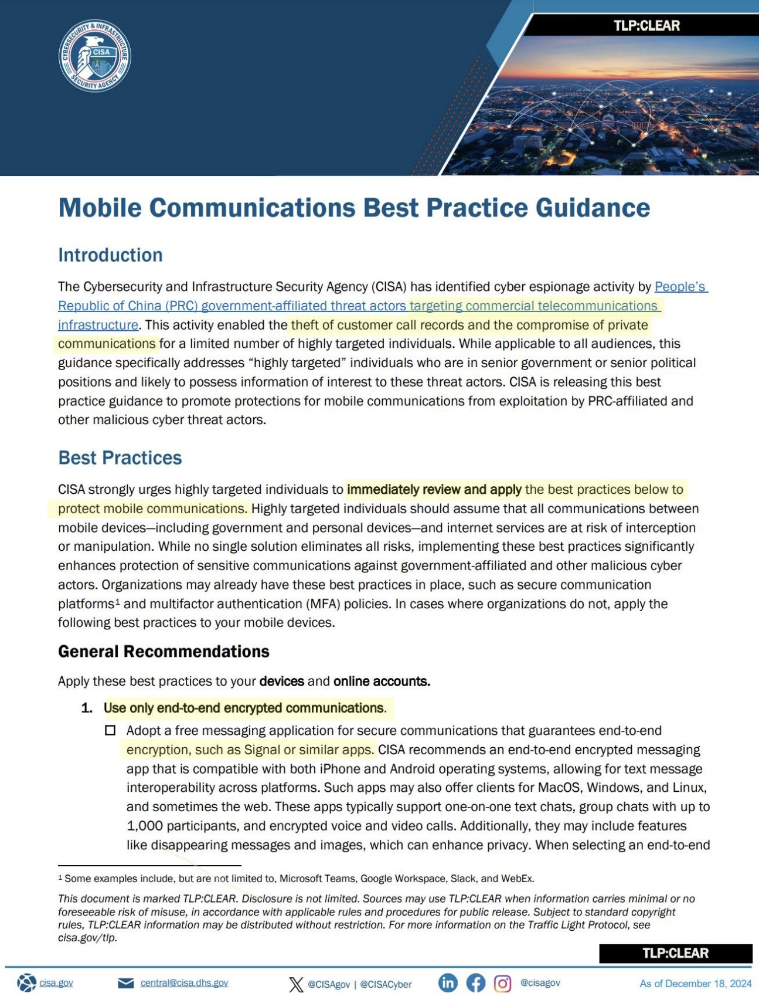

For more information refer to my <a href="https://x.com/CompSciFutures/status/2047584011485421897?s=20">post on X</a>.

## Remote keystroke logging in Windows 11

Consider this:

<a href="https://x.com/raunak_yadush/status/2044740735216533564">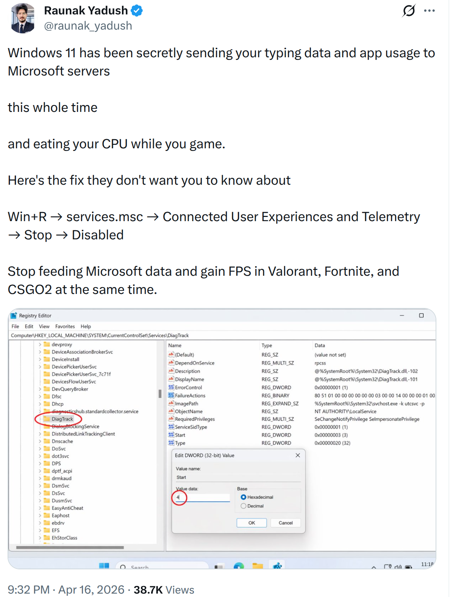</a>

I really do worry sometimes how Regulated Industry expects us to maintain the controls and integrity they
need so they can maintain their systems.
<a href="https://x.com/CompSciFutures/status/2044621286442446952?s=20">Where have all the 64-bit computers gone to</a>?
The ones we should be using? That were made this millenium, for this millenium by people like those 
from Xerox PARC from last millenium that really did know what they were doing, more so than today.

### Divesting from CIA controlled tech

- Get off Google & Microsoft Cloud (they have #McKinsey CEOs that like to 'oh-whoops' your data out of existence)
- Get off anything connected to #McKinsey or #InQTel - they are where #CIA psychos go to work when they don't have a CIA gig. They are CIA controlled.
- Your #local #police & #government work with McKinsey and InQTel so they can access CIA tech. Try to avoid them.
- Avoid #SaltLakeCity connected technology (e.g.: #Adobe. #NSA & #SaltLakeCity #Mormons are buddies because that's where their data center is, and #CIA controls #NSA).
- When #NSA is around, every OT network is an IOT network, and it's impossible to keep #OT off The Internet. 
- When #CIA is around, assume this: every speaker is a microphone, every microphone is a speaker. And every IOT is connected to CIA.

Get over it, that's reality. So Police, Office365, Azure, Windows 11 & Google Workspace (unless you can get on staff) is out,
otherwise forget about security anything. Welcome to the 2020s.

NB: Through a weird twist of fate, Xerox PARC & The Commonwealth actually owns the #SaltLakeCity land #NSA, #Adobe and #Mormons are on - don't ask, DYODD. FR.

Anyways - don't get too bogged down in this: At least you now know the risk profile and have a few good risk treatments. We can only use what we have available to us. But I do worry for the future.

## Classification labels and #Commerce vs. #Military vs. #Intelligence

- We (CS & EE) are classified as #civilian / #commerce, however secrectly, we actually have a classification label so secret no government is allowed to know about it: #Proprietary. Commerce can't function without #Proprietary.

- If you are in heavy duty #SiliconValley innovation or hardcore #ComputerScience like I am, then we carry an even more secret label: #FutureProprietary.

- Signals Intelligence/#SIGINT is actually #Military #Defence, but only in peacetime - not when #Military goes full #WAR. We work with/as Defence Industrial Contractors all the time. They are cool.

- #Intelligence is not allowed anywhere near #Military, #Defence, #Commerce or #Civillians. They are freeking bat-shit-crazy lunatics. If you ever need to communicate with intelligence, there are #DMZs you can communicate in but best to hand it to someone oboarded to 5-eyes like myself to handle.

- If you really have to speak to #Intelligence, there is always a "front door" in every country that is supposed to have sane peopple manning the phones/letterbox. Write your note on a piece of paper drop it in the box then RUN. RUN FOR YOUR LIVES! FR. This is a problem because "some things you do not write down" (actually lots of things in #ComputerScience). They understand that concept, just say those words. Or hand it to a #CS/#EE that has been onboarded to 5-eyes and they will fly to a DMZ (every 5-eyes approved site has a #DMZ nearby where we can talk as #Professional #Civillians - or is supposed to. I do miss the old days).

- And again: #Intelligence is not allowed near #Commerce, #Civillian, #Industry, #Academia and definitely not #proprietary.

- #Government is definitely not allowed to mess with #proprietary either, which dates back at least 1000 years via the #BritishEmpire/#RomanEmpire/#ChineseEmpire because: #SilkRoad, #Commerce, #Logistics & #TradeWinds was an amazing thing 1,000 years ago. 

- #Intelligence (such as CIA) is not allowed near #ComputerScience or #SiliconValley (so what is #McKinsey & #InQTel? - it's a hole in the network)

- What is 5 eyes? It's a system of treaties designed to prevent #Intelligence from putting holes in our network.

- My personal label is: #InternetCommerce. I represent the future and current #proprietary of #InternetCommerce, and I'm definitely listed in global databases as #ComputerScience and #SiliconValley, so I'm a DEFINITELY DO NOT COME NEAR ME.

- #Police these days we classify as #Intelligence, because they've been speaking to and use too much technology from #CIA & #NSA.

- Once upon a time #NSA (when they were No Such Agency) were respected and we could talk to them, but these days, they are just #CIA #Intelligence.

- If a nation state wants computers, it must have #ComputerScience. To have Computer Science, they must have #Modernity, which is only possible if they have #RulesBasedOrder. We are very committed to #RulesBasedOrder - it's a necessary requirement before learning properly good #ComputerScience. 

- The particular rule from #RulesBasedOrder that #CompSci requires to exist is at an absolute minimum: "Respecting the #Privacy of #Proprietary"

- The second rule from #RulesBasedOrder that #Government must adhere to is: "#Intelligence is not allowed to move one single chess piece, ever"

- And #CIA is premised on this #RulesBasedOrder rule: "#CIA cannot exist without #Compartmentalisation". #Compartmentalisation died ages ago due to globalization, and #CIA have been off the chain ever since.

- NB: In USA, there is the no-write-down rule associated with the <a href="https://medium.com/@lydia.cao26/security-policies-the-bell-lapadula-model-and-the-biba-model-24ddb500c8a1">Bell-LaPadula</a> model. This may be relevant to you - I ignore it because #proprietary is so much more secret than any label any government anything has, their top top top top secret ends well before our "Public Corpus of Knowledge" begins.

- The only solution I see to this moving forward is: #ComputerScienceWithGuns. I have seen it before during peak #ServerMasters era, it's not really my style, but it does work. Soon #CS schools will include #BasicWeaponsTraining from #Military or #SIGINT, or have it as a prerequisite.

Violate this framework and you will all be unwinding #Modernity and #Civilization and going back to #HunterGatherers where 100% of your time is about food, for everyone on the planet.

HTH.

Q.E.D

# MRTG/RRD Integration for Performance Graphing

APMonitor integrates with MRTG (Multi Router Traffic Grapher) and RRDtool to provide historical performance graphs of resource availability and response times. This integration enables trend analysis, capacity planning, and visual monitoring dashboards.

## Quick Start

Install MRTG and related dependencies:
```bash
sudo make installmrtg
```

This installs nginx on port 888, fcgiwrap for CGI support, and sets up the MRTG web interface.

Enable RRD data collection by running APMonitor with `--generate-mrtg-config`:
```bash
./APMonitor.py -vv -s /var/tmp/apmonitor-statefile.json config.yaml --generate-mrtg-config
```

Access graphs at `http://localhost:888/mrtg/<site-name>/` or `http://<your-ip>:888/mrtg/<site-name>/`.

## How It Works

When `--generate-mrtg-config` is specified:

1. **RRD Collection Enabled**: APMonitor records response times and availability status to RRDtool databases
2. **MRTG Config Generated**: Creates a `.mrtg.cfg` file derived from the statefile path
3. **Site subdirectory created**: MRTG output (index.html, detail pages) is written to `/var/www/html/mrtg/<site-name>/` where `<site-name>` is sanitised from `site.name` in the config
4. **Web Interface Updated**: Updates `mrtg-rrd.cgi.pl` with the new config path and generates `index.html`
5. **Continuous Updates**: Subsequent runs update RRD files and regenerate the index with latest metrics and outage state

**Output file locations:**
- Statefile: `/var/tmp/APMonitor/<config-stem>.statefile.json`
- MRTG config: `/var/tmp/APMonitor/<config-stem>.statefile.mrtg.cfg`
- RRD databases:
  - Availability monitors: `/var/tmp/APMonitor/<config-stem>.statefile.rrd/<monitor>-availability.rrd`
  - SNMP monitors: `/var/tmp/APMonitor/<config-stem>.statefile.rrd/<monitor>-snmp.rrd`
- MRTG index: `/var/www/html/mrtg/<site-name>/index.html`
- Detail pages: `/var/www/html/mrtg/<site-name>/<type>-<monitor>-detail.html`
- Web interface: `http://localhost:888/mrtg/<site-name>/`

## Command Options

Generate MRTG config with default base working directory (`/var/www/html/mrtg`):
```bash
./APMonitor.py apmonitor-config.yaml --generate-mrtg-config
```

Specify a custom base working directory (site subdirectory is always appended):
```bash
./APMonitor.py apmonitor-config.yaml --generate-mrtg-config /var/www/html/graphs
```

## RRD Data Collection

### Availability Monitors (ping, http, quic, tcp, udp)

Each availability monitor's RRD file tracks two metrics:

- **`response_time`** (GAUGE, milliseconds): Time taken for check to complete
  - Range: 0 to unlimited
  - Value: `U` (unknown) when check fails

- **`is_up`** (GAUGE, boolean): Service availability
  - `100` = service up
  - `0` = service down

### SNMP Monitors (port, ports, host)

All SNMP-family monitors (`port`, `ports`, `host`) use a single unified RRD schema per device. The schema is divided into three sections: per-interface DS pairs (used by `ports`/`port` only), fixed aggregate network DS (used by `ports`/`port`; stored as `U` for `host`), and fixed host performance DS (used by `host`; stored as `U` for `ports`/`port`).

**Filename**: `/var/tmp/APMonitor/<config-stem>.statefile.rrd/<monitor-name>-snmp.rrd`

**Per-Interface Data Sources** (one pair per discovered interface, COUNTER — `ports`/`port` only):

- **`if{index}_in`**: Inbound bytes for interface at ifIndex `{index}` (IF-MIB::ifInOctets)
- **`if{index}_out`**: Outbound bytes for interface at ifIndex `{index}` (IF-MIB::ifOutOctets)

DS names use the raw ifIndex integer (e.g., `if1_in`, `if2_out`), not the interface description string. DS order is stable — interfaces are sorted numerically by ifIndex at both create and update time.

**Fixed Aggregate Network Data Sources** (COUNTER — `ports`/`port` populated, `host` stores `U`):

- **`tcp_retrans`**: Global TCP retransmit segment counter (TCP-MIB::tcpRetransSegs) — `ports` only
- **`total_bits_in`**: Sum of inbound octets × 8 across all interfaces
- **`total_bits_out`**: Sum of outbound octets × 8 across all interfaces
- **`total_pkts_in`**: Sum of all inbound packets (unicast + multicast + broadcast) across all interfaces
- **`total_pkts_out`**: Sum of all outbound packets across all interfaces
- **`total_errors_in`**: Sum of inbound interface errors across all interfaces (IF-MIB::ifInErrors)
- **`total_errors_out`**: Sum of outbound interface errors across all interfaces (IF-MIB::ifOutErrors)
- **`total_pkts_ucast`**: Total unicast packets in+out combined across all interfaces
- **`total_pkts_bmcast`**: Total broadcast+multicast packets in+out combined across all interfaces

**System Resource Data Sources** (GAUGE — all types):

- **`cpu_load`**: CPU utilization percentage, range 0–100. Sourced from vendor-specific OIDs (Cisco/HP/Juniper/Ubiquiti) with HOST-RESOURCES-MIB::hrProcessorLoad as fallback. Stored as `U` if unavailable.
- **`memory_pct`**: Memory utilization percentage, range 0–100. Sourced from vendor-specific OIDs with HOST-RESOURCES-MIB::hrStorage as fallback. Stored as `U` if unavailable.

**Fixed Host Performance Data Sources** (COUNTER/GAUGE — `host` populated, `ports`/`port` store `U`):

- **`context_switches`** (COUNTER): Raw context switch counter (UCD-SNMP-MIB::ssRawContexts)
- **`swap_io`** (COUNTER): Raw swap pages in + out combined (UCD-SNMP-MIB::ssRawSwapIn + ssRawSwapOut)
- **`disk_read`** (COUNTER): Disk read bytes summed across all block devices (UCD-DISKIO-MIB::diskIOReadX)
- **`disk_write`** (COUNTER): Disk write bytes summed across all block devices (UCD-DISKIO-MIB::diskIOWriteX)
- **`disk_space_pct`** (GAUGE): Root filesystem utilization percentage 0–100 (HOST-RESOURCES-MIB::hrStorage `/` entry). Also persisted to statefile for display in MRTG index and detail page headers.
- **`swap_used`** (GAUGE): Swap space used in bytes (HOST-RESOURCES-MIB::hrStorage virtual memory entry, with UCD-SNMP-MIB::memTotalSwap − memAvailSwap as fallback)
- **`interrupts`** (COUNTER): Raw hardware interrupt counter (UCD-SNMP-MIB::ssRawInterrupts)

**Fixed Tamper/Network Capacity Data Sources** (GAUGE — `ports` only, `port`/`host` store `U`):

- **`ports_up_count`**: Count of interfaces with oper=up
- **`nvram_flash_bytes`**: Sum of used bytes across NVRAM/flash hrStorage entries
- **`mac_count`**: Count of learned FDB entries via Q-BRIDGE-MIB
- **`arp_count`**: Count of ARP entries via ipNetToPhysicalTable / ipNetToMediaTable

**Total fixed DS count: 22** (11 network/system + 7 host performance + 4 tamper/network). Expected DS count for auto-heal check = `(2 × interface_count) + 22`.

**MRTG Targets generated per monitor type:**

| Target suffix | DS pair | Monitor types | Description |
|---|---|---|---|
| `-bandwidth` | `total_bits_in` / `total_bits_out` | `ports`, `port` | Total bandwidth in/out (bits) |
| `-packets` | `total_pkts_in` / `total_pkts_out` | `ports`, `port` | Total packets in/out |
| `-packets-type` | `total_pkts_ucast` / `total_pkts_bmcast` | `ports`, `port` | Unicast vs broadcast+multicast |
| `-errors` | `total_errors_in` / `total_errors_out` | `ports`, `port` | Interface errors in/out |
| `-retransmits` | `tcp_retrans` / `tcp_retrans` | `ports` only | TCP retransmits (single line) |
| `-system` | `cpu_load` / `memory_pct` | `ports` only | CPU & memory utilization |
| `-tamper` | `ports_up_count` / `nvram_flash_bytes` | `ports` only | Active ports & NVRAM/flash bytes |
| `-network` | `mac_count` / `arp_count` | `ports` only | Learned MACs & ARP entries |
| `-system1` | `cpu_load` / `context_switches` | `host` | CPU & Load |
| `-system2` | `memory_pct` / `swap_io` | `host` | Memory & Paging |
| `-system3` | `disk_read` / `disk_write` | `host` | Disk I/O (Disk Use % in PageTop) |
| `-system4` | `swap_used` / `interrupts` | `host` | System Thrashing |

**Notes:**
- COUNTER type automatically calculates per-second rates and handles 32/64-bit wraparound.
- All interfaces for a device are stored in a single RRD for atomic updates. If the interface list changes, stale DS entries remain in the RRD unused — the RRD is never recreated on interface list change alone.
- If the discovered interface count grows such that the expected DS count exceeds what was created, APMonitor auto-heals by deleting and recreating the RRD on the next run.
- `disk_space_pct` is stored in the RRD as a GAUGE DS and also persisted to the statefile so that `generate_mrtg_config()` and `generate_mrtg_index()` can embed the live value (e.g., `Disk Use: 73.4%`) in MRTG PageTop headers and index cell headings without a live SNMP poll at generation time. Displays as `Disk Use: N/A` until the first successful poll.
- UCD-SNMP-MIB host performance metrics (context switches, swap I/O, disk I/O, interrupts) are Linux `net-snmp` specific. On network devices (Cisco, HP, Juniper, Ubiquiti), these DS will store `U`.

### RRD Retention Policy

| Time Range | Resolution | MRTG Standard Rows | APMonitor Default |
|---|---|---|---|
| High-resolution recent | Native step | 1 day native | 31 days native |
| Short-term | 5-minute | 600 (~2 days) | 18600 (~64 days) |
| Medium-term | 30-minute | 600 (~12.5 days) | 18600 (~387 days) |
| Long-term | 1-hour | — | 43830 (~5 years) |
| Historical | 1-day | 732 (~2 years) | 22692 (~62 years) |

> [!WARNING]
> Be careful if upgrading to the 1.3.x stream. This release contains RRD schema changes that require existing RRD files to be deleted and recreated before upgrading. APMonitor will auto-heal existing RRDs on first run when `--generate-rrds` or `--generate-mrtg-config` is specified.

To use custom retention, modify the row constants in `create_rrd_rras()`:
```python
rows_1day_native  = 86400 // step_secs * 31  # 31 days at native resolution
rows_2days_5min   = 18600                     # ~64 days at 5-min
rows_12days_30min = 18600                     # ~387 days at 30-min
rows_5years_1hour = 43830                     # ~5 years at 1-hour
rows_2years_daily = 22692                     # ~62 years at 1-day
```

## Working with RRD Files Directly
```bash
# Query availability RRD database info
rrdtool info /var/tmp/APMonitor/apmonitor-config.statefile.rrd/monitor-name-availability.rrd

# Query SNMP RRD database info
rrdtool info /var/tmp/APMonitor/apmonitor-config.statefile.rrd/switch-snmp.rrd

# Run APMonitor with MRTG & RRD enabled
./APMonitor.py -vv apmonitor-config.yaml --generate-mrtg-config

# Check when the RRD was created
ls -la /var/tmp/APMonitor/apmonitor-config.statefile.rrd/tellusion-gw-availability.rrd

# Dump RRD info to see its structure
rrdtool info /var/tmp/APMonitor/apmonitor-config.statefile.rrd/tellusion-gw-availability.rrd | head -50

# Check the last update timestamp
rrdtool lastupdate /var/tmp/APMonitor/apmonitor-config.statefile.rrd/tellusion-gw-availability.rrd

# Fetch the last 300 seconds
rrdtool fetch /var/tmp/APMonitor/apmonitor-config.statefile.rrd/tellusion-gw-availability.rrd AVERAGE -s end-300 -e now

# Fetch SNMP interface data
rrdtool fetch /var/tmp/APMonitor/apmonitor-config.statefile.rrd/switch-snmp.rrd AVERAGE -s end-3600 -e now
```

**References:**
- [MRTG-RRD Documentation](https://directory.fsf.org/wiki/Mrtg-rrd)
- [mrtg-rrd.cgi FAQ](https://web.archive.org/web/20081228131907/http://www.fi.muni.cz:80/~kas/mrtg-rrd/cvsweb.cgi/FAQ?rev=HEAD)
- *System Performance Tuning*, 2nd Ed. — Gian-Paolo D. Musumeci & Mike Loukides (O'Reilly) — the canonical reference for the host performance metrics collected by `type: host`

**Note:** RRD data collection is disabled by default. Run with `--generate-mrtg-config` once to enable, then continue normal monitoring to collect historical data.

# `APMonitor.py` YAML/JSON Site Configuration Options

APMonitor uses a YAML or JSON configuration file to define the site being monitored and the resources to check. The configuration consists of two main sections: site-level settings that apply globally, and per-monitor settings that define individual resources to check.

## Complete Example Configuration

Here's a complete example showing all available configuration options:
```yaml
site:
  name: "HomeLab"

  email_server:
    smtp_host: "smtp.gmail.com"
    smtp_port: 587
    smtp_username: "alerts@example.com"
    smtp_password: "app_password_here"
    from_address: "alerts@example.com"
    use_tls: true

  outage_emails:
    - email: "admin@example.com"
      email_outages: true
      email_recoveries: true
      email_reminders: true
    - email: "manager@example.com"
      email_outages: yes
      email_recoveries: yes
      email_reminders: no

  outage_webhooks:
    - endpoint_url: "https://api.pushover.net/1/messages.json"
      request_method: POST
      request_encoding: JSON
      request_prefix: "token=your_app_token&user=your_user_key&message="
      request_suffix: ""

  max_threads: 1
  max_retries: 3
  max_try_secs: 20
  check_every_n_secs: 60
  notify_every_n_secs: 600
  after_every_n_notifications: 1

monitors:
  # Single-port MAC-pinning monitor (hidden from MRTG display, monitoring continues)
  - type: port
    name: "switch-port0"
    address: snmp://192.168.1.6
    community: TellusionLab
    check_every_n_secs: 10
    notify_every_n_secs: 60
    after_every_n_notifications: 6
    port: 0
    mac: 18:E8:29:45:F8:F7
    always_up: yes
    display: false

  # Switch port status + SNMP metrics monitoring
  - type: ports
    name: office-switch
    address: "snmp://192.168.1.6"
    community: "public"
    percentile: 95
    check_every_n_secs: 10
    notify_every_n_secs: 3600
    after_every_n_notifications: 1

  # Host performance monitoring (CPU, memory, disk I/O, swap, interrupts)
  - type: host
    name: debmon-host
    address: "snmp://192.168.1.10"
    community: "public"
    check_every_n_secs: 300

  # TCP port check with send/receive
  - type: tcp
    name: smtp-server
    address: "tcp://mail.example.com:25"
    send: "EHLO apmonitor\r\n"
    content_type: text
    expect: "250"
    check_every_n_secs: 60

  # TCP connection-only check
  - type: tcp
    name: mysql-db
    address: "tcp://192.168.1.100:3306"
    check_every_n_secs: 30

  # UDP send with hex data
  - type: udp
    name: custom-protocol
    address: "udp://192.168.1.200:9999"
    send: "01 02 03 04"
    content_type: hex
    expect: "OK"
    check_every_n_secs: 60

  # UDP send with text data
  - type: udp
    name: syslog-collector
    address: "udp://192.168.1.50:514"
    send: "<134>APMonitor: test message"
    check_every_n_secs: 300

  - type: ping
    name: home-fw
    address: "192.168.1.1"
    check_every_n_secs: 60
    email: true
    heartbeat_url: "https://hc-ping.com/uuid-here"
    heartbeat_every_n_secs: 300

  - type: http
    name: in3245622
    address: "http://192.168.1.21/Login?oldUrl=Index"
    expect: "System Name: <b>HomeLab</b>"
    check_every_n_secs: 120
    notify_every_n_secs: 3600
    after_every_n_notifications: 5
    email: yes

  - type: http
    name: json-api
    address: "https://api.example.com/webhook"
    send: '{"event": "test", "status": "ok"}'
    content_type: "application/json"
    expect: "success"

  - type: http
    name: nvr0
    address: "https://192.168.1.12/api/system"
    expect: "nvr0"
    ssl_fingerprint: "a1b2c3d4e5f67890abcdef1234567890abcdef1234567890abcdef1234567890"
    ignore_ssl_expiry: true
    email: false
    heartbeat_url: "https://plus.site24x7.com/hb/uuid/nvr0"
    heartbeat_every_n_secs: 60

  - type: quic
    name: fast-api
    address: "https://192.168.1.50/api/health"
    expect: "ok"
    check_every_n_secs: 30
```

## site: configuration options

The `site` section defines global settings for the monitoring site.

### Required Fields

- **`name`** (string): The name of the site being monitored. Used in notification messages and as the MRTG output subdirectory name (sanitised to a filesystem-safe string).
```yaml
site:
  name: "HomeLab"
```

### Optional Fields

- **`email_server`** (object, optional): SMTP server configuration for sending email notifications. Required if `outage_emails` is configured.
```yaml
email_server:
  smtp_host: "smtp.gmail.com"
  smtp_port: 587
  smtp_username: "alerts@example.com"
  smtp_password: "app_password_here"
  from_address: "alerts@example.com"
  use_tls: true
```
  - **`smtp_host`** (string, required): SMTP server hostname or IP address
  - **`smtp_port`** (integer, required): SMTP server port (typically 587 for TLS, 465 for SSL, 25 for unencrypted). Must be between 1 and 65535
  - **`smtp_username`** (string, optional): SMTP authentication username
  - **`smtp_password`** (string, optional): SMTP authentication password. Use app-specific passwords for Gmail/Google Workspace
  - **`from_address`** (string, required): Email address to use in the "From" field. Must be a valid email address
  - **`use_tls`** (boolean, optional): Whether to use TLS/STARTTLS encryption. Default: true

**Note**: For Gmail/Google Workspace, you must use an [app-specific password](https://support.google.com/accounts/answer/185833) rather than your account password. Port 587 with `use_tls: true` is the recommended configuration for most SMTP servers.

- **`outage_emails`** (list of objects, optional): Email addresses to notify when resources go down or recover. Requires `email_server` to be configured.
```yaml
outage_emails:
  - email: "admin@example.com"
    email_outages: true
    email_recoveries: true
    email_reminders: true
  - email: "oncall@example.com"
    email_outages: yes
    email_recoveries: no
```
  - **`email`** (string, required): Valid email address
  - **`email_outages`** (boolean/integer/string, optional): Send email when resource goes down. Default: true
  - **`email_recoveries`** (boolean/integer/string, optional): Send email when resource recovers. Default: true
  - **`email_reminders`** (boolean/integer/string, optional): Send email for ongoing outage reminders. Default: true

- **`outage_webhooks`** (list of objects, optional): Webhook endpoints to call when resources go down or recover.
```yaml
outage_webhooks:
  - endpoint_url: "https://api.example.com/alerts"
    request_method: POST
    request_encoding: JSON
    request_prefix: ""
    request_suffix: ""
```
  - **`endpoint_url`** (string, required): Valid URL with scheme and host
  - **`request_method`** (string, required): HTTP method, must be `GET` or `POST`
  - **`request_encoding`** (string, required): Message encoding format:
    - `URL`: URL-encode the message (for query parameters or form data)
    - `HTML`: HTML-escape the message
    - `JSON`: Send as JSON object with `message` field (POST only)
    - `CSVQUOTED`: CSV-quote the message for comma-separated values
  - **`request_prefix`** (string, optional): String to prepend to encoded message (e.g., API tokens, field names)
  - **`request_suffix`** (string, optional): String to append to encoded message

- **`max_threads`** (integer, optional): Number of concurrent threads for checking resources in parallel. Must be ≥ 1. Default: 1 (single-threaded). Can be overridden by command line `-t` option.
```yaml
max_threads: 1
```

**Note**: For near-realtime monitoring environments, set `max_threads` to 5-15 to enable parallel checking of multiple resources. Single-threaded mode (1) is recommended for small systems like Raspberry Pi or when log clarity is important. This setting is overridden by the `-t` command line argument if specified.

- **`max_retries`** (integer, optional): Number of times to retry failed checks before marking resource as down. Must be ≥ 1. Default: 3
```yaml
max_retries: 3
```

**Note**: For near-realtime monitoring, set `max_retries: 1` to reduce detection latency. Higher values (3-5) are better for unstable networks where transient failures are common.

- **`max_try_secs`** (integer, optional): Timeout in seconds for each individual check attempt. Must be ≥ 1. Default: 20
```yaml
max_try_secs: 20
```

- **`check_every_n_secs`** (integer, optional): Default seconds between checks for all monitors. Individual monitors can override this with their own `check_every_n_secs` setting. Must be ≥ 1. Default: 60
```yaml
check_every_n_secs: 300
```

**Note**: This sets the baseline check interval for all monitors. Can be overridden per-monitor for resources requiring different check frequencies. When a monitor's configuration changes (detected via SHA-256 checksum), it is checked immediately regardless of this interval.

- **`notify_every_n_secs`** (integer, optional): Default minimum seconds between outage notifications for all monitors. Individual monitors can override this with their own `notify_every_n_secs` setting. Must be ≥ 1. Default: 600
```yaml
notify_every_n_secs: 1800
```

**Note**: This sets the baseline notification throttling interval. Combined with `after_every_n_notifications`, controls the notification escalation curve for all monitors unless overridden per-monitor.

- **`after_every_n_notifications`** (integer, optional): Default number of notifications after which the notification interval reaches `notify_every_n_secs` for all monitors. Individual monitors can override this with their own `after_every_n_notifications` setting. Must be ≥ 1. Default: 1 (constant notification intervals)
```yaml
after_every_n_notifications: 1
```

**Note**: When set to a value > 1, notification intervals start shorter and gradually increase following a quadratic Bezier curve until reaching `notify_every_n_secs` after the specified number of notifications. This provides more frequent alerts at the start of an outage when immediate attention is needed, then reduces notification frequency as the outage continues. A value of 1 maintains constant notification intervals (original behavior).

- **`alarms`** (boolean/integer/string, optional): Master switch to enable/disable all outage/recovery/reminder notifications for every monitor in this site. Accepts: `true`/`yes`/`on`/`1` (case-insensitive) for enabled, `false`/`no`/`off`/`0` for disabled. Default: true
```yaml
alarms: false
```

**Note**: When set to `false`, no email or webhook notifications are sent for any monitor in the site. Monitoring, state tracking, heartbeats, RRD collection, and MRTG display all continue unaffected. Useful for silencing a site during planned maintenance or initial deployment. Can be overridden per-monitor with a monitor-level `alarms` setting.

## monitors: configuration options

The `monitors` section is a list of resources to monitor. Each monitor defines what to check and how often.

### Required Fields (All Monitor Types)

- **`type`** (string): Type of check to perform. Must be one of:
  - `ping`: ICMP ping check
  - `http`: HTTP/HTTPS endpoint check (supports both HTTP and HTTPS schemes, follows and checks redirect chain for errors)
  - `quic`: HTTP/3 over QUIC endpoint check (UDP-based, faster than HTTP/HTTPS for high-latency networks)
  - `tcp`: TCP port connectivity and protocol check
  - `udp`: UDP datagram send/receive check
  - `ports`: SNMP network device monitor — collects interface bandwidth/packet/error metrics, TCP retransmits, CPU & memory, and tracks per-interface oper/admin state and MAC address changes
  - `port`: SNMP single-port MAC-pinning monitor (pins one switch port to one MAC address; fires alerts on wrong MAC, port down, or MAC absence depending on `always_up`)
  - `host`: SNMP host performance monitor — collects CPU, memory, disk I/O, swap activity, and hardware interrupt metrics per *System Performance Tuning* (Musumeci & Loukides, O'Reilly)

> [!NOTE]
> `type: snmp` has been removed. Use `type: ports` for network device monitoring or `type: host` for server performance monitoring.

- **`name`** (string): Unique identifier for this monitor.

- **`address`** (string): Resource to check. Format depends on monitor type:
  - For `ping`: Valid hostname, IPv4, or IPv6 address
  - For `http`/`quic`: Full URL with scheme and host
  - For `tcp`: URL with `tcp://` scheme, hostname/IP, and port (e.g., `tcp://server.example.com:22`)
  - For `udp`: URL with `udp://` scheme, hostname/IP, and port (e.g., `udp://192.168.1.1:161`)
  - For `ports`: URL with `snmp://` scheme and hostname/IP (e.g., `snmp://192.168.1.1` or `snmp://192.168.1.1:161`)
  - For `port`: URL with `snmp://` scheme and hostname/IP — uses SNMP transport, same format as `ports` (e.g., `snmp://192.168.1.6`)
  - For `host`: URL with `snmp://` scheme and hostname/IP — uses SNMP transport, same format as `ports` (e.g., `snmp://192.168.1.10`)

### Optional Fields (All Monitor Types)

- **`check_every_n_secs`** (integer, optional): Seconds between checks for this resource. Overrides site-level `check_every_n_secs`. Must be ≥ 1. Default: 60 (or site-level setting if configured)
```yaml
check_every_n_secs: 300
```

**Note**: When a monitor's configuration changes (any field modification), the monitor is checked immediately on the next run regardless of this interval. Configuration changes are detected via SHA-256 checksum stored in the state file.

- **`notify_every_n_secs`** (integer, optional): Minimum seconds between outage notifications while resource remains down. Must be ≥ 1 and ≥ `check_every_n_secs`. Default: 600
```yaml
notify_every_n_secs: 1800
```

- **`after_every_n_notifications`** (integer, optional): Number of notifications after which the notification interval reaches `notify_every_n_secs` for this specific monitor. Overrides site-level `after_every_n_notifications`. Can only be specified if `notify_every_n_secs` is present. Must be ≥ 1.
```yaml
notify_every_n_secs: 3600
after_every_n_notifications: 5
```

**Behavior**: Notification timing follows a quadratic Bezier curve—intervals start shorter and gradually increase over the first N notifications until reaching the full `notify_every_n_secs` interval. After N notifications, the interval remains constant at `notify_every_n_secs`. This provides aggressive early alerting that tapers off as outages persist.

- **`email`** (boolean/integer/string, optional): Master switch to enable/disable email notifications for this specific monitor. Accepts: `true`/`yes`/`on`/`1` (case-insensitive) for enabled, `false`/`no`/`off`/`0` for disabled. Default: true (enabled if `email_server` configured)
```yaml
email: true
```

**Note**: When set to `false`, this monitor will not send any email notifications regardless of site-level `outage_emails` configuration. Useful for non-critical resources or during maintenance windows. This is a monitor-level override that takes precedence over all other email settings.

- **`display`** (boolean/integer/string, optional): Controls whether this monitor appears in the MRTG index page. Accepts: `true`/`yes`/`on`/`1` (case-insensitive) for visible, `false`/`no`/`off`/`0` for hidden. Default: true (displayed)
```yaml
display: false
```

**Note**: When set to `false`, the monitor is completely excluded from the MRTG index HTML output and MRTG config file — no graphs are generated and no graph cells appear. Monitoring, alerting, heartbeats, and RRD data collection continue unaffected. Hidden monitors are listed by name in a small audit footer at the bottom of the MRTG index page; if a hidden monitor is down, its name appears in red in that footer so outages remain visible as a detective control. Useful for suppressing internal infrastructure monitors (e.g., the APMonitor host itself) that would clutter the dashboard without adding operational value.

- **`alarms`** (boolean/integer/string, optional): Enable/disable all outage/recovery/reminder notifications for this specific monitor. Accepts: `true`/`yes`/`on`/`1` (case-insensitive) for enabled, `false`/`no`/`off`/`0` for disabled. Default: true (or site-level `alarms` setting if configured)
```yaml
alarms: false
```

**Note**: Monitor-level `alarms` overrides site-level `alarms`. When set to `false`, no email or webhook notifications are sent for this monitor. Monitoring, state tracking, heartbeats, RRD collection, and MRTG display all continue unaffected. Useful for silencing noisy or non-critical monitors without removing them from the config.

- **`heartbeat_url`** (string, optional): URL to ping (HTTP GET) when resource check succeeds. Useful for external monitoring services like Site24x7 or Healthchecks.io. Must be valid URL with scheme and host.
```yaml
heartbeat_url: "https://hc-ping.com/your-uuid-here"
```

- **`heartbeat_every_n_secs`** (integer, optional): Seconds between heartbeat pings. Must be ≥ 1. Can only be specified if `heartbeat_url` is present. If not specified, heartbeat is sent on every successful check.
```yaml
heartbeat_every_n_secs: 300
```

### HTTP/QUIC Monitor Specific Fields

These fields are only valid for monitors with `type: http` or `type: quic`:

- **`expect`** (string, optional): Substring that must appear in the HTTP response body for the check to succeed. If not present, any 200 OK response is considered successful. The check performs a simple string search—if the expected content appears anywhere in the response body, the check passes.
```yaml
expect: "System Name: <b>HomeLab</b>"
```

**Note**: The `expect` field is string-only for simplicity. It performs exact substring matching (case-sensitive). For complex validation scenarios requiring status code checks, header validation, or regex matching, consider using external monitoring tools or extending APMonitor.

- **`ssl_fingerprint`** (string, optional): SHA-256 fingerprint of the expected SSL/TLS certificate (with or without colons). Enables certificate pinning for self-signed certificates. When specified, the certificate is verified before making the HTTP request.
```yaml
ssl_fingerprint: "e85260e8f8e85629cfa4d023ea0ae8dd3ce8ccc0040b054a4753c2a5ab269296"
```

- **`ignore_ssl_expiry`** (boolean/integer/string, optional): Skip SSL/TLS certificate expiration checking. Accepts: `true`/`1`/`"yes"`/`"ok"` (case-insensitive) for true, or `false`/`0`/`"no"` for false. Useful for development environments or when certificate renewal is managed separately.
```yaml
ignore_ssl_expiry: true
```

### HTTP/QUIC POST Request Fields

These optional fields enable HTTP/QUIC monitors to send POST requests with data:

- **`send`** (string, optional): Data to send in HTTP/QUIC POST request body. When specified, the monitor sends a POST request instead of GET. Data is always UTF-8 encoded.
```yaml
send: '{"event": "test", "status": "ok"}'
```

- **`content_type`** (string, optional): MIME type for the Content-Type header. Can only be specified if `send` is present. This is a raw MIME type string (e.g., `application/json`, `application/x-www-form-urlencoded`, `text/plain`). Default: `text/plain; charset=utf-8`
```yaml
content_type: "application/json"
send: '{"event": "test", "status": "ok"}'
```

**HTTP JSON POST Example:**
```yaml
- type: http
  name: json-api
  address: "https://api.example.com/webhook"
  send: '{"event": "test", "status": "ok"}'
  content_type: "application/json"
  expect: "success"
```

**HTTP Form POST Example:**
```yaml
- type: http
  name: form-submit
  address: "https://example.com/submit"
  send: "name=test&value=123"
  content_type: "application/x-www-form-urlencoded"
  expect: "received"
```

**QUIC POST Example:**
```yaml
- type: quic
  name: text-endpoint
  address: "https://fast.example.com/log"
  send: "Test message"
  content_type: "text/plain; charset=utf-8"
```

**Note**: HTTP/QUIC monitors without `send` perform GET requests (original behavior). The `content_type` for HTTP/QUIC is a raw MIME type header, unlike TCP/UDP where it specifies encoding format (text/hex/base64).

### TCP/UDP Monitor Specific Fields

These fields are only valid for monitors with `type: tcp` or `type: udp`:

- **`send`** (string, optional for TCP, **required for UDP**): Data to send to the service. UDP monitors require this parameter because UDP is connectionless and needs application-layer data to verify connectivity.
```yaml
send: "EHLO apmonitor\r\n"
```

- **`content_type`** (string, optional): Encoding format for the `send` data. Can only be specified if `send` is present. Valid values:
  - `text` (default): UTF-8 encoded string
  - `hex`: Hexadecimal byte string (spaces and colons are stripped)
  - `base64`: Base64-encoded binary data
```yaml
content_type: hex
send: "01 02 03 04"
```

**Note**: TCP monitors without `send` perform connection-only checks. TCP monitors automatically attempt to receive data after connecting (useful for banner protocols like SSH, SMTP, FTP). UDP monitors without `expect` succeed if the packet is sent without socket errors, but cannot verify if the service is actually listening.

- **`expect`** (string, optional): Substring that must appear in the response for the check to succeed. For TCP, this validates the received banner or response. For UDP, this requires a matching response to be received.
```yaml
expect: "SSH-2.0"
```

**UDP Behavior Notes**:
- **With `expect`**: Real service validation (recommended for SNMP, DNS, NTP) - waits for response and validates content
- **Without `expect`**: Fire-and-forget (useful for syslog, statsd) - succeeds if packet sends without socket error, cannot detect if port is listening
- UDP is connectionless, so there's no "connection established" signal like TCP's three-way handshake

### Ports Monitor Specific Fields

The `ports` monitor type polls a managed network switch, router, or Linux host via SNMPv2c. It combines two orthogonal functions in one monitor: it collects bandwidth, packet, error, TCP retransmit, CPU, and memory metrics into RRD (the former `type: snmp` function), and it also tracks the operational and administrative status of every interface plus the set of learned MAC addresses on each port (the original `ports` function), firing one notification per changed interface.

> [!NOTE]
> `type: ports` subsumes the former `type: snmp`. If you previously used `type: snmp` for bandwidth/metric monitoring, change it to `type: ports`. The only functional difference is that `ports` also performs port state and MAC change detection; for devices where that is not relevant (e.g., a Linux host with no managed switching), the MAC walk will simply return empty results harmlessly.

**Required Fields:**
- **`type`**: Must be `ports`
- **`address`**: URL with `snmp://` scheme and hostname/IP — same format as former `snmp` monitors (e.g., `snmp://192.168.1.6`). Uses IF-MIB via SNMP transport.

**Optional Fields:**

- **`community`** (string, optional): SNMP community string. Default: `public`

- **`percentile`** (integer, optional): Percentile value to compute and display beneath each MRTG graph (e.g., `95` for 95th percentile billing). Must be an integer between 1 and 99. When specified, the Nth percentile is calculated over the graphed time range and shown in the stats table below each graph alongside Max/Average/Current.

  The 95th percentile is the standard metric for burstable bandwidth ("95th percentile billing"), which discards the top 5% of traffic samples to allow for short bursts without penalising peak usage in capacity planning.
```yaml
- type: ports
  name: office-switch
  address: "snmp://192.168.1.6"
  community: "public"
  percentile: 95
  check_every_n_secs: 300
```

  **Note**: `percentile` is only valid for `ports` and `port` monitors and has no effect unless `--generate-mrtg-config` is also used.

- **`notify_every_n_secs`** / **`after_every_n_notifications`** (integers, optional): Control the per-interface silence window for port state change alerts. Default values from site config apply.

**Monitored MIB Objects:**
- **IF-MIB::ifDescr** (1.3.6.1.2.1.2.2.1.2) — Interface name/description (single walk shared by metrics and state)
- **IF-MIB::ifOperStatus** (1.3.6.1.2.1.2.2.1.8) — Operational status
- **IF-MIB::ifAdminStatus** (1.3.6.1.2.1.2.2.1.7) — Administrative status
- **IF-MIB::ifInOctets / ifOutOctets** (1.3.6.1.2.1.2.2.1.10/16) — Byte counters per interface
- **IF-MIB::ifInErrors / ifOutErrors** (1.3.6.1.2.1.2.2.1.14/20) — Error counters per interface
- **IF-MIB::ifHCIn/OutUcastPkts, ifHCIn/OutMulticastPkts, ifHCIn/OutBroadcastPkts** — 64-bit packet counters
- **TCP-MIB::tcpRetransSegs** (1.3.6.1.2.1.6.12.0) — Global TCP retransmit counter
- **Vendor-specific CPU OIDs** (Cisco/HP/Juniper/Ubiquiti) → fallback HOST-RESOURCES-MIB::hrProcessorLoad
- **Vendor-specific memory OIDs** (Cisco/HP/Juniper/Ubiquiti) → fallback HOST-RESOURCES-MIB::hrStorage
- **Q-BRIDGE-MIB::dot1qTpFdbPort** (1.3.6.1.2.1.17.7.1.2.2.1.2) — MAC-to-port mappings
- **Q-BRIDGE-MIB::dot1qTpFdbStatus** (1.3.6.1.2.1.17.7.1.2.2.1.3) — FDB entry status (learned=3 filter)

**MRTG Targets generated:** `-bandwidth`, `-packets`, `-packets-type`, `-errors`, `-retransmits`, `-system`, `-tamper`, `-network` (see MRTG targets table above).

**State Tracking:**

The state file stores one key per `ports` monitor:
- `ports_state`: committed baseline — dict of `{if_index: {name, oper, admin, macs}}` per interface; advances to current state on each successful poll

**Field Restrictions:**
- `expect`, `ssl_fingerprint`, `ignore_ssl_expiry`, `send`, `content_type` are not valid for `ports` monitors
- `ports` monitors support `heartbeat_url` and `heartbeat_every_n_secs` like other monitor types

**Example Ports Monitor Configuration:**
```yaml
- type: ports
  name: office-switch
  address: "snmp://192.168.1.6"
  community: "public"
  percentile: 95
  check_every_n_secs: 30
  notify_every_n_secs: 3600
  after_every_n_notifications: 1
```

**Sample Notification Output:**
```
##### PORT CHANGE: office-switch in HomeLab: GigabitEthernet0/2 oper=down admin=up (was oper=up admin=up) at 2:15 PM #####
##### PORT MAC CHANGE: office-switch in HomeLab: GigabitEthernet0/1 MAC change appeared=[AA:BB:CC:DD:EE:FF] at 2:22 PM #####
```

### Host Monitor Specific Fields

The `host` monitor type polls a Linux host (or any net-snmp compatible device) via SNMPv2c for system performance metrics drawn from UCD-SNMP-MIB and HOST-RESOURCES-MIB. The four MRTG charts generated correspond directly to the canonical performance tuning metrics defined in *System Performance Tuning* by Gian-Paolo D. Musumeci & Mike Loukides (O'Reilly, 2nd Ed.).

`type: host` uses the same SNMP RRD schema as `ports` and `port`. Network DS (`total_bits_*`, `total_pkts_*`, etc.) are stored as `U` since `host` does not poll interface counters.

**Required Fields:**
- **`type`**: Must be `host`
- **`address`**: URL with `snmp://` scheme and hostname/IP (e.g., `snmp://192.168.1.10`)

**Optional Fields:**

- **`community`** (string, optional): SNMP community string. Default: `public`

**MRTG Charts Generated:**

| Slot | DS pair | Title | Description |
|---|---|---|---|
| `-system1` | `cpu_load` / `context_switches` | CPU & Load | CPU utilization % + context switches/sec |
| `-system2` | `memory_pct` / `swap_io` | Memory & Paging | Memory utilization % + swap I/O rate |
| `-system3` | `disk_read` / `disk_write` | Disk I/O | Disk read/write bytes/sec (all devices summed). Disk space utilization % shown in PageTop header as *Disk Use: ##.#%* |
| `-system4` | `swap_used` / `interrupts` | System Thrashing | Swap used bytes + hardware interrupts/sec |

**Disk Space Display**: The current root filesystem utilization percentage is embedded in the MRTG `-system3` detail page header (PageTop) and in the MRTG index cell heading, e.g., `Disk I/O — Disk Use: 73.4%`. The value is read from state (persisted on each successful poll) so it updates on every monitoring cycle without requiring a live SNMP poll at graph generation time. Displays as `Disk Use: N/A` until the first successful poll.

**Monitored MIB Objects:**
- **HOST-RESOURCES-MIB::hrProcessorLoad** (1.3.6.1.2.1.25.3.3.1.2) — CPU load per core (averaged)
- **HOST-RESOURCES-MIB::hrStorage** (1.3.6.1.2.1.25.2.3.1.*) — Physical memory, swap, and root filesystem utilization
- **UCD-SNMP-MIB::ssRawContexts** (1.3.6.1.4.1.2021.11.60.0) — Raw context switch counter
- **UCD-SNMP-MIB::ssRawSwapIn** (1.3.6.1.4.1.2021.11.62.0) — Raw swap-in counter
- **UCD-SNMP-MIB::ssRawSwapOut** (1.3.6.1.4.1.2021.11.63.0) — Raw swap-out counter
- **UCD-SNMP-MIB::ssRawInterrupts** (1.3.6.1.4.1.2021.11.59.0) — Raw hardware interrupt counter
- **UCD-SNMP-MIB::memTotalReal / memAvailReal** (1.3.6.1.4.1.2021.4.5/6.0) — Memory fallback if hrStorage unavailable
- **UCD-SNMP-MIB::memTotalSwap / memAvailSwap** (1.3.6.1.4.1.2021.4.3/4.0) — Swap fallback if hrStorage unavailable
- **UCD-DISKIO-MIB::diskIOReadX** (1.3.6.1.4.1.2021.13.15.1.1.5) — 64-bit disk read bytes per device (walked, summed)
- **UCD-DISKIO-MIB::diskIOWriteX** (1.3.6.1.4.1.2021.13.15.1.1.6) — 64-bit disk write bytes per device (walked, summed)

**Notes:**
- UCD-SNMP-MIB OIDs (`ssRaw*`, `diskIO*`) are Linux `net-snmp` specific. On network devices these DS store `U`.
- Disk I/O bytes are summed across all block devices discovered by `diskIOTable`. This gives aggregate host I/O throughput rather than per-device breakdown.
- hrStorage physical memory and swap are used preferentially; UCD memTotal/memAvail OIDs are fallback.
- Root filesystem is identified by matching hrStorageDescr against `/`, `root`, `c:\`, or `c:`.

**Field Restrictions:**
- `expect`, `ssl_fingerprint`, `ignore_ssl_expiry`, `send`, `content_type`, `percentile` are not valid for `host` monitors
- `host` monitors support `heartbeat_url` and `heartbeat_every_n_secs` like other monitor types

**Example Host Monitor Configuration:**
```yaml
- type: host
  name: debmon-host
  address: "snmp://192.168.1.10"
  community: "YourCommunityString"
  check_every_n_secs: 300
  heartbeat_url: "https://hc-ping.com/uuid-here"
  heartbeat_every_n_secs: 600
```

### Port Monitor Specific Fields

The `port` monitor type polls a single switch port by ifIndex via SNMPv2c, pinning it to a specific MAC address. It is orthogonal to the `ports` type: `ports` watches all interfaces on a device holistically; `port` watches one interface with a hard MAC binding.

**Required Fields:**
- **`type`**: Must be `port`
- **`address`**: URL with `snmp://` scheme and hostname/IP — same format as `snmp`/`ports` (e.g., `snmp://192.168.1.6`)
- **`port`** (integer): ifIndex of the switch port to monitor. Must be a non-negative integer. This is the raw ifIndex as returned by IF-MIB, not a zero-based port number.
- **`mac`** (string): Pinned MAC address in `XX:XX:XX:XX:XX:XX` format (case-insensitive). This is the expected device on the port.

**Optional Fields:**

- **`community`** (string, optional): SNMP community string. Default: `public`

- **`percentile`** (integer, optional): Percentile value for MRTG graphs. Must be an integer between 1 and 99. See `ports` monitor for details.

- **`always_up`** (boolean/integer/string, optional): Controls alarm semantics. Default: `false`

**Alarm Logic:**

| Condition | `always_up: true` | `always_up: false` |
|---|---|---|
| Port oper≠up | Alarm | No alarm |
| Pinned MAC absent from port | Alarm | No alarm |
| Wrong MAC present on port | Alarm | Alarm |
| All clear | Recovery | Recovery |

- **`always_up: true`**: The port must be operationally up AND the pinned MAC must be present AND be the only learned MAC. Any deviation alarms.
- **`always_up: false`**: Only alarms when a non-pinned MAC is present on the port. Port down and MAC absence are silent (useful for ports that legitimately go idle).

**Recovery:** A recovery notification fires whenever all alarm conditions clear.

**MAC Resolution:**

Uses Q-BRIDGE-MIB (RFC 2674) `dot1qTpFdbTable` — the correct table for VLAN-aware managed switches. The classic `dot1dTpFdbTable` (BRIDGE-MIB) returns zero entries on VLAN-aware hardware because its FDB is partitioned per VLAN. MAC walk failure is non-fatal: monitoring continues with `current_mac=None`, which only triggers alarms when `always_up=true` (MAC absent condition).

**State Tracking:**

The state file stores one key per `port` monitor:
- `port_state`: dict of `{oper, mac}` from last successful poll — used for observability and future state transition logging

**Field Restrictions:**
- `expect`, `ssl_fingerprint`, `ignore_ssl_expiry`, `send`, `content_type` are not valid for `port` monitors
- `port` monitors support `heartbeat_url` and `heartbeat_every_n_secs` like other monitor types

**Example Configuration:**
```yaml
- type: port
  name: "switch-port0"
  address: snmp://192.168.1.6
  community: TellusionLab
  check_every_n_secs: 10
  notify_every_n_secs: 60
  after_every_n_notifications: 6
  port: 0
  mac: 18:E8:29:45:F8:F7
  always_up: yes
```

With `always_up: yes`, this fires an alarm if ifIndex 0 is not oper=up, if `18:E8:29:45:F8:F7` is absent, or if any other MAC is present on that port.

**Sample Notification Output:**
```
##### NEW OUTAGE: switch-port0 in HomeLab new outage: port ifIndex=0 18:E8:29:45:F8:F7 is down (admin=up) (snmp://192.168.1.6) at 2:15 PM, down for 0 secs #####
##### NEW OUTAGE: switch-port0 in HomeLab new outage: port ifIndex=0 is up but pinned MAC 18:E8:29:45:F8:F7 absent (snmp://192.168.1.6) at 2:16 PM, down for 0 secs #####
##### NEW OUTAGE: switch-port0 in HomeLab new outage: port ifIndex=0 wrong MAC: expected 18:E8:29:45:F8:F7, got AA:BB:CC:DD:EE:FF (snmp://192.168.1.6) at 2:17 PM, down for 0 secs #####
##### RECOVERY: switch-port0 in HomeLab is UP (snmp://192.168.1.6) at 2:18 PM, outage lasted 1 mins 3 secs #####
```

### Example Configurations

#### **Ping Monitor:**
```yaml
- type: ping
  name: home-gateway
  address: "192.168.1.1"
  check_every_n_secs: 60
  heartbeat_url: "https://hc-ping.com/uuid-here"
```

#### **HTTP Monitor with Content Check:**
```yaml
- type: http
  name: web-server
  address: "http://192.168.1.100/health"
  expect: "status: ok"
  check_every_n_secs: 120
  notify_every_n_secs: 3600
```

#### **HTTPS Monitor with Certificate Pinning:**
```yaml
- type: http
  name: nvr0
  address: "https://192.168.1.12/api/system"
  expect: "nvr0"
  ssl_fingerprint: "e85260e8f8e85629cfa4d023ea0ae8dd3ce8ccc0040b054a4753c2a5ab269296"
  ignore_ssl_expiry: true
  heartbeat_url: "https://plus.site24x7.com/hb/uuid/nvr0"
  heartbeat_every_n_secs: 60
```

#### **QUIC Monitor (HTTP/3):**
```yaml
- type: quic
  name: fast-api
  address: "https://api.example.com/health"
  expect: "healthy"
  check_every_n_secs: 30
  ssl_fingerprint: "a1b2c3d4e5f67890abcdef1234567890abcdef1234567890abcdef1234567890"
```

**Note**: QUIC monitoring uses HTTP/3 over UDP (port 443 by default) and is particularly effective for high-latency networks or when monitoring resources over unreliable connections. QUIC provides built-in connection migration and improved performance compared to TCP-based HTTP/2.

#### **TCP Banner Check (SSH):**
```yaml
- type: tcp
  name: ssh-server
  address: "tcp://server.example.com:22"
  expect: "SSH-2.0"
  check_every_n_secs: 60
```

#### **TCP Send/Receive (SMTP):**
```yaml
- type: tcp
  name: smtp-server
  address: "tcp://mail.example.com:25"
  send: "EHLO apmonitor\r\n"
  content_type: text
  expect: "250"
  check_every_n_secs: 60
```

#### **TCP Connection-Only Check:**
```yaml
- type: tcp
  name: mysql-db
  address: "tcp://192.168.1.100:3306"
  check_every_n_secs: 30
```

#### **UDP with Response Validation (DNS):**
```yaml
- type: udp
  name: dns-server
  address: "udp://8.8.8.8:53"
  send: "..." # DNS query packet
  content_type: hex
  expect: "..." # Expected response
  check_every_n_secs: 60
```

#### **UDP Fire-and-Forget (Syslog):**
```yaml
- type: udp
  name: syslog-collector
  address: "udp://192.168.1.50:514"
  send: "<134>APMonitor: test message"
  check_every_n_secs: 300
```

#### **Network Switch with 95th Percentile (formerly `type: snmp`):**
```yaml
- type: ports
  name: office-switch
  address: "snmp://192.168.1.6"
  community: "public"
  percentile: 95
  check_every_n_secs: 300
  heartbeat_url: "https://hc-ping.com/uuid-switch"
  heartbeat_every_n_secs: 600
```

#### **Host Performance Monitor:**
```yaml
- type: host
  name: debmon-host
  address: "snmp://192.168.1.10"
  community: "public"
  check_every_n_secs: 300
```

#### **Switch Port Status + Metrics + MAC Change Monitor:**
```yaml
- type: ports
  name: office-switch
  address: "snmp://192.168.1.6"
  community: "public"
  check_every_n_secs: 30
  notify_every_n_secs: 3600
  after_every_n_notifications: 1
```

#### **Single Port MAC Pinning Monitor:**
```yaml
- type: port
  name: "switch-port0"
  address: snmp://192.168.1.6
  community: TellusionLab
  check_every_n_secs: 10
  notify_every_n_secs: 60
  after_every_n_notifications: 6
  port: 0
  mac: 18:E8:29:45:F8:F7
  always_up: yes
```

#### Hidden Monitor (monitoring continues, excluded from MRTG display):
```yaml
- type: port
  name: "switch-port0"
  address: snmp://192.168.1.6
  community: TellusionLab
  port: 0
  mac: 18:E8:29:45:F8:F7
  always_up: yes
  display: false
```

#### Silenced Monitor (monitoring and display continue, notifications suppressed):
```yaml
- type: ports
  name: office-switch
  address: "snmp://192.168.1.6"
  community: "public"
  alarms: false
```

### Validation Rules

The configuration validator enforces these rules:

1. Monitor names must be unique across all monitors
2. `notify_every_n_secs` must be ≥ `check_every_n_secs` if both specified
3. `heartbeat_every_n_secs` can only be specified if `heartbeat_url` exists
4. `expect`, `ssl_fingerprint`, and `ignore_ssl_expiry` are only valid for HTTP/QUIC monitors
5. `expect` must be a non-empty string if specified
6. All URLs must include both scheme (http/https/tcp/udp/snmp) and hostname
7. Email addresses must match standard email format (RFC 5322 simplified)
8. SSL fingerprints must be valid hexadecimal strings with length that's a power of two
9. `after_every_n_notifications` can only be specified if `notify_every_n_secs` is present
10. `outage_emails` can only be specified if `email_server` is configured
11. If `email_server` is present, `smtp_host`, `smtp_port`, and `from_address` are required
12. `smtp_username` and `smtp_password` are optional (for servers without authentication)
13. Email control flags (`email_outages`, `email_recoveries`, `email_reminders`) accept boolean or string values
14. Monitor-level `email` flag accepts boolean or string values
15. TCP monitors must use `tcp://` scheme, UDP monitors must use `udp://` scheme
16. TCP/UDP addresses must include hostname/IP and port
17. UDP monitors require `send` parameter
18. `content_type` can only be specified if `send` is present
19. `content_type` for TCP/UDP must be one of: text, hex, base64 (for HTTP/QUIC it's a raw MIME type string)
20. `ssl_fingerprint` and `ignore_ssl_expiry` are not allowed for TCP/UDP monitors
21. `ports` monitors must use `snmp://` scheme (SNMP transport)
22. `community` field is optional for `ports`/`port`/`host` monitors and must be a non-empty string if specified
23. `expect`, `ssl_fingerprint`, `ignore_ssl_expiry`, `send`, and `content_type` are not allowed for `ports` monitors
24. `ports` monitors support `heartbeat_url` and `heartbeat_every_n_secs` like other monitor types
25. `percentile` is only valid for `ports` and `port` monitors and must be an integer between 1 and 99
26. `port` monitors must use `snmp://` scheme (SNMP transport)
27. `port` monitors require `port` (non-negative integer ifIndex) and `mac` (valid `XX:XX:XX:XX:XX:XX` address)
28. `always_up` is optional for `port` monitors and accepts boolean or string values
29. `expect`, `ssl_fingerprint`, `ignore_ssl_expiry`, `send`, `content_type` are not allowed for `port` monitors
30. `port` monitors support `heartbeat_url` and `heartbeat_every_n_secs` like other monitor types
31. `host` monitors must use `snmp://` scheme (SNMP transport)
32. `expect`, `ssl_fingerprint`, `ignore_ssl_expiry`, `send`, `content_type`, `percentile` are not allowed for `host` monitors
33. `host` monitors support `heartbeat_url` and `heartbeat_every_n_secs` like other monitor types
34. `type: snmp` is not valid — the validator emits: *"type 'snmp' is not valid. Did you mean type: ports?"*
35. `display` is optional for all monitor types and accepts boolean or string values; when `false`, the monitor is excluded from MRTG index output but monitoring, alerting, heartbeats, and RRD collection continue unaffected; hidden monitors appear in the MRTG index audit footer and render in red when down
36. `alarms` is optional at both site and monitor level; accepts boolean or string values; monitor-level `alarms` overrides site-level `alarms`; when `false`, all outage/recovery/reminder notifications are suppressed while monitoring, state tracking, heartbeats, RRD collection, and MRTG display continue unaffected

# Dependencies

Install system-wide for production use:
```bash
sudo apt install python3-rrdtool librrd-dev python3-dev mrtg rrdtool librrds-perl libsnmp-dev
sudo pip3 install --break-system-packages PyYAML requests pyOpenSSL urllib3 aioquic rrdtool easysnmp
```

**Note**:
- The `aioquic` package is required for QUIC/HTTP3 monitoring support. If you don't plan to use `type: quic` monitors, you can omit this dependency.
- The `easysnmp` package and `libsnmp-dev` system library are required for SNMP monitoring support. If you don't plan to use `type: ports`, `type: port`, or `type: host` monitors, you can omit these dependencies.

# Example invocations
```bash
# Single site, auto-derived statefile
./APMonitor.py homelab-monitorhosts.yaml

# Single site, explicit statefile
./APMonitor.py -s /tmp/statefile.json homelab-monitorhosts.yaml

# Multiple sites (concurrent subprocesses, no -s allowed)
./APMonitor.py site1.yaml site2.yaml site3.yaml --generate-mrtg-config

# Test configuration
./APMonitor.py --test-config homelab-monitorhosts.yaml

# Test webhooks
./APMonitor.py --test-webhooks -v homelab-monitorhosts.yaml

# Test emails
./APMonitor.py --test-emails -v homelab-monitorhosts.yaml
```

# Command Line Usage

APMonitor is invoked from the command line with various options to control verbosity, threading, state file location, and testing modes.

## Synopsis
```
./APMonitor.py [OPTIONS] <config_file> [<config_file> ...]
```

## Command Line Options

- **`config_file`** (required, repeatable): Path to one or more YAML or JSON configuration files. When multiple files are specified, each runs as an independent subprocess concurrently. `-s` is not valid with multiple config files.

- **`-v, --verbose`**: Increase verbosity level (can be repeated: `-v`, `-vv`, `-vvv`).

- **`-t, --threads <N>`**: Number of concurrent threads per site for checking resources (default: 1). Overrides `max_threads` in site config.

- **`-s, --statefile <path>`**: Path to state file. Only valid with a single config file. Default: `/var/tmp/APMonitor/<config-stem>.statefile.json`.

- **`--test-config`**: Validate configuration and print a summary of monitors, then exit. Does not check resources or touch the statefile.

- **`--test-webhooks`**: Send a test alert to all configured webhooks, then exit.

- **`--test-emails`**: Send a test alert to all configured email addresses, then exit.

- **`--generate-rrds`**: Enable RRD database creation and updates (implied by `--generate-mrtg-config`).

- **`--generate-mrtg-config [WORKDIR]`**: Generate MRTG config, update `mrtg-rrd.cgi.pl`, write `index.html` and detail pages into `WORKDIR/<site-name>/`. Default WORKDIR: `/var/www/html/mrtg`. Implies `--generate-rrds`.

## Common Usage Examples

### Basic Monitoring (Single-Threaded)

Run with default settings, state stored in tmpfs:
```
./APMonitor.py -s /tmp/statefile.json monitoring-config.yaml
```

### Verbose Monitoring for Debugging

Show detailed progress and decision-making:
```
./APMonitor.py -v -s /tmp/statefile.json monitoring-config.yaml
```

### High-Frequency Monitoring (Multiple Threads)

Check many resources concurrently for near-realtime behavior:
```
./APMonitor.py -t 10 -s /tmp/statefile.json monitoring-config.yaml
```

Use higher thread counts (`-t 5` to `-t 20`) when:
- Monitoring many independent resources (50+)
- Resources have long check timeouts
- Near-realtime alerting is required
- System has sufficient CPU cores

**Warning**: High thread counts increase lock contention. Test with `-v` to ensure checks aren't blocking each other.

### Test Webhook Configuration

Verify webhooks are configured correctly before production use:
```
./APMonitor.py --test-webhooks -v monitoring-config.yaml
```

This sends test messages to all configured webhooks with verbose output showing request/response details.

### Test Email Configuration

Verify email settings work correctly:
```
./APMonitor.py --test-emails -v monitoring-config.yaml
```

## Running `APMonitor.py` Continuously

APMonitor is designed to be run repeatedly rather than as a long-running daemon.

### Option 1: Cron (Recommended for Most Cases)
```
* * * * * /path/to/APMonitor.py /path/to/monitoring-config.yaml 2>&1 | logger -t apmonitor
```

NB: PID file locking should keep this under control, in case you get a long-running process.

**Advantages**:
- Automatic restart if process crashes
- Built-in scheduling
- System handles process lifecycle
- Easy to enable/disable (comment out cron entry)

**Best for**: Production systems, servers with standard monitoring requirements (check intervals ≥ 60 seconds)

### Option 2: While Loop (For Sub-Minute Monitoring)

Run continuously with short sleep intervals for near-realtime monitoring:
```
#!/bin/bash
while true; do
    ./APMonitor.py -t 5 monitoring-config.yaml
    sleep 5
done
```

Or as a one-liner:
```
while true; do ./APMonitor.py -s /tmp/statefile.json monitoring-config.yaml; sleep 30; done
```

**Advantages**:
- Sub-minute check intervals
- Near-realtime alerting
- Fine control over execution frequency

**Best for**: Development, testing, systems requiring rapid failure detection (check intervals < 60 seconds)

**Note**: Use short sleep intervals (5-30 seconds) combined with per-resource `check_every_n_secs` settings to balance responsiveness and system load. APMonitor's internal scheduling prevents redundant checks even with frequent invocations.

### Systemd Service (Alternative)

For production deployments requiring process supervision:
```
[Unit]
Description=APMonitor Network Resource Monitor
After=network.target

[Service]
Type=simple
ExecStart=/bin/bash -c 'while true; do /usr/local/bin/APMonitor.py -vv /usr/local/etc/apmonitor-config.yaml --generate-mrtg-config; sleep 5; done'
Restart=always
RestartSec=5
User=monitoring
StandardOutput=journal
StandardError=journal

[Install]
WantedBy=multi-user.target
```

## Default State File Location

APMonitor automatically selects a platform-appropriate default location for the state file if the `-s/--statefile` option is not specified:

### Linux, macOS, FreeBSD, OpenBSD, NetBSD
**Default**: `/var/tmp/APMonitor/<config-stem>.statefile.json`

- Directory `/var/tmp/APMonitor/` is created automatically with mode `755` (no www-data write access)
- Persists across system reboots (unlike `/tmp`)
- All sibling files (`.new`, `.old`, `.mrtg.cfg`, `.rrd/`) live in the same directory

### Windows
**Default**: `%TEMP%\APMonitor\<config-stem>.statefile.json`

### Unknown/Other Platforms
**Default**: `./<config-stem>.statefile.json`

## Concurrency and Multiple Instances

When multiple config files are passed on the command line, APMonitor spawns one subprocess per config and joins all before exiting. Each subprocess runs completely independently with its own statefile, RRD database, lock file, and MRTG output directory. A PID lockfile (hashed from the config path) in `/tmp/` prevents duplicate instances per config.

For manual multi-instance operation with separate invocations, use separate config files — the config filename determines the statefile path and PID lock, so correct cardinality is enforced automatically:
```bash
# Instance 1: Production monitoring
./APMonitor.py prod-apmonitor-config.yaml --generate-mrtg-config

# Instance 2: Development monitoring
./APMonitor.py dev-apmonitor-config.yaml --generate-mrtg-config
```

# Developer Notes for modifying `APMonitor.py`

## State File

APMonitor uses a JSON state file to persist monitoring data across runs:

- **Location**: `/var/tmp/APMonitor/<config-stem>.statefile.json` by default
- **Format**: JSON with per-resource nested objects containing timestamps, status, and counters
- **Atomic Updates**: Uses `.new` and `.old` rotation to prevent corruption on crashes
- **Thread Safety**: Protected by internal lock during concurrent access

The state file tracks per-resource:
- `is_up`: Current resource status
- `last_checked`: When resource was last checked (ISO 8601 timestamp)
- `last_response_time_ms`: Response time in milliseconds for successful checks
- `last_notified`: When last notification was sent (ISO 8601 timestamp)
- `last_alarm_started`: When current/last outage began (ISO 8601 timestamp)
- `last_successful_heartbeat`: When heartbeat URL last succeeded (ISO 8601 timestamp)
- `down_count`: Consecutive failed checks
- `notified_count`: Number of notifications sent for current outage
- `error_reason`: Last error message
- `last_config_checksum`: SHA-256 hash of monitor configuration (detects config changes)
- `disk_space_pct`: (`host` monitors only) most recently polled root filesystem utilization percentage; used by MRTG config and index generators to embed live disk use in chart headers without a live SNMP poll
- `ports_state`: (`ports` monitors only) committed baseline — dict of `{if_index: {name, oper, admin, macs}}` per interface; `macs` is a sorted list of learned MAC addresses in `AA:BB:CC:DD:EE:FF` format sourced from Q-BRIDGE-MIB; advances to current state on each successful poll
- `port_state`: (`port` monitors only) last polled state — dict of `{oper, mac}` where `oper` is the IF-MIB operational status string and `mac` is the learned MAC address (or `None` if absent/unavailable)

And at the top level:
- `execution_time`: ISO 8601 timestamp of last run completion
- `execution_ms`: Duration of last run in milliseconds

**Note**: If using `/tmp/statefile.json`, the state file is cleared on system reboot. This resets all monitoring history but doesn't affect functionality—monitoring resumes normally on first run.

**Configuration Change Detection**: The `last_config_checksum` field stores a SHA-256 hash of the entire monitor configuration (all fields including `type`, `name`, `address`, `expect`, etc.). When APMonitor detects a configuration change (checksum mismatch), it immediately checks that monitor regardless of `check_every_n_secs` timing. This ensures configuration changes take effect on the next run without waiting for the scheduled check interval.

## Execution Flow

Here are some basic devnotes on how APMonitor is built, in case you want to modify it.

Each invocation of APMonitor:

1. Acquires a PID lockfile in `/tmp/` hashed from the config path
2. Loads and validates configuration file
3. Loads previous state from statefile (if exists)
4. For each monitor (in thread pool):
   - Calculates SHA-256 checksum of monitor configuration
   - Checks if configuration changed (checksum mismatch) or `check_every_n_secs` elapsed since `last_checked`
   - If config changed: checks immediately (bypasses timing)
   - If due: performs resource check
   - If down and `notify_every_n_secs` elapsed: sends notifications (unless `alarms: false`)
   - If up and heartbeat configured: pings heartbeat URL if due
   - Updates state atomically with new checksum
5. If `--generate-mrtg-config`: generates MRTG config, index.html, and detail pages
6. Saves statefile atomically
7. Releases PID lockfile

This design allows APMonitor to be killed/restarted safely at any time without losing monitoring history or creating duplicate notifications.

## Modifying with AI

APMonitor was designed with an engineering-based approach to AI-assisted development in mind, should you wish to change it.

Steps:

1. Paste in `READAI.md` (containing an Entrance Prompt) into your favourite AI coding tool
2. Paste in `APMonitor.py` (tell your AI this is the source code)
3. Paste in `README.md` (tell your AI this is the documentation)
4. Vibe your changes as you see fit.

Enjoy!


# Installation Instructions - Debian Linux

This guide covers installing APMonitor as a systemd service on Debian-based systems (Debian 10+, Ubuntu 20.04+).

## Prerequisites

Fresh Debian/Ubuntu system with sudo access.

## Automated Install - Quickstart

If you want to do an automated install, just follow these instructions, otherwise start with **Step 1** below:
```
# Install (requires root)
sudo make install

# Edit configuration
sudo nano /usr/local/etc/apmonitor-config.yaml

# Test configuration
make test-config

# Enable and start service
sudo make enable

# Check status
make status

# View logs
make logs

# Restart after config changes
sudo make restart

# Migrate statefiles from older versions
sudo make migrate

# Uninstall completely
sudo make uninstall
```

## Step 1: Install System Dependencies
```bash
sudo apt update
sudo apt install python3 python3-pip libsnmp-dev -y
```

## Step 2: Install Python Dependencies

Install dependencies globally (required for systemd service):
```
sudo pip3 install --break-system-packages PyYAML requests pyOpenSSL urllib3 aioquic easysnmp
```

**Note**: On Debian 12+, the `--break-system-packages` flag is required. On older systems, omit this flag:
```
sudo pip3 install PyYAML requests pyOpenSSL urllib3 aioquic easysnmp
```

**Dependencies installed**:
- `PyYAML` - YAML configuration file parsing
- `requests` - HTTP/HTTPS resource checking and webhook notifications
- `pyOpenSSL` - SSL certificate verification and fingerprint checking
- `urllib3` - HTTP connection pooling (dependency of requests)
- `aioquic` - QUIC/HTTP3 protocol support (required for `type: quic` monitors)
- `easysnmp` - SNMP monitoring support (required for `type: ports`, `type: port`, and `type: host` monitors)

## Step 3: Create Monitoring User

Create a dedicated system user for running APMonitor:
```
sudo useradd -r -s /bin/bash -d /var/lib/apmonitor -m monitoring
sudo usermod -a -G www-data monitoring
```

## Step 4: Install APMonitor

Copy the APMonitor script and example configuration to system locations:
```
# Install APMonitor script
sudo cp APMonitor.py /usr/local/bin/
sudo chmod +x /usr/local/bin/APMonitor.py

# Install example configuration
sudo cp example-apmonitor-config.yaml /usr/local/etc/apmonitor-config.yaml
sudo chown monitoring:monitoring /usr/local/etc/apmonitor-config.yaml
sudo chmod 640 /usr/local/etc/apmonitor-config.yaml
```

**Important**: Edit `/usr/local/etc/apmonitor-config.yaml` to configure your monitoring targets, notification endpoints, and site name before proceeding.

## Step 5: Create systemd Service

Create the systemd service definition:
```
sudo nano /etc/systemd/system/apmonitor.service
```

Paste the following content:
```
[Unit]
Description=APMonitor Network Resource Monitor
After=network.target

[Service]
Type=simple
ExecStart=/bin/bash -c 'while true; do /usr/local/bin/APMonitor.py -vv /usr/local/etc/apmonitor-config.yaml --generate-mrtg-config; sleep 5; done'
Restart=always
RestartSec=5
User=monitoring
StandardOutput=journal
StandardError=journal

[Install]
WantedBy=multi-user.target
```

## Step 6: Enable and Start Service

Reload systemd, enable the service to start on boot, and start it:
```
sudo systemctl daemon-reload
sudo systemctl enable apmonitor.service
sudo systemctl start apmonitor.service
```

## Step 7: Verify Operation

Check service status:
```
sudo systemctl status apmonitor.service
```

View live logs:
```
sudo journalctl -u apmonitor.service -f
```

View recent logs:
```
sudo journalctl -u apmonitor.service -n 100
```

## Troubleshooting

### Test APMonitor Manually

Run APMonitor manually as the monitoring user to verify configuration:
```
sudo -u monitoring /usr/local/bin/APMonitor.py -vv -s /var/tmp/apmonitor-statefile.json /usr/local/etc/apmonitor-config.yaml
```

### Test Webhook Notifications

Test webhook configuration without checking resources:
```
sudo -u monitoring /usr/local/bin/APMonitor.py --test-webhooks -v /usr/local/etc/apmonitor-config.yaml
```

### Test Email Notifications

Test email configuration without checking resources:
```
sudo -u monitoring /usr/local/bin/APMonitor.py --test-emails -v /usr/local/etc/apmonitor-config.yaml
```

### Check State File Permissions

Verify the monitoring user can write to the state file location:
```
ls -la /var/tmp/APMonitor/
```

The `/var/tmp` directory should have permissions `1777` (drwxrwxrwt) allowing any user to create files.

### View Configuration

Display the active configuration:
```
sudo cat /usr/local/etc/apmonitor-config.yaml
```

### Service Management Commands
```
# Stop service
sudo systemctl stop apmonitor.service

# Restart service (after config changes)
sudo systemctl restart apmonitor.service

# Disable service from starting on boot
sudo systemctl disable apmonitor.service

# Check if service is enabled
sudo systemctl is-enabled apmonitor.service
```

## Updating Configuration

After modifying `/usr/local/etc/apmonitor-config.yaml`, the changes take effect automatically on the next monitoring cycle (typically within 30 seconds). APMonitor detects configuration changes via SHA-256 checksums and immediately checks any modified monitors, so you don't need to restart the service unless you want immediate effect.

To force immediate checking of all monitors after config changes:
```
sudo systemctl restart apmonitor.service
```

## Uninstallation

To completely remove APMonitor:
```bash
sudo make uninstall
```

Or manually:
```bash
# Stop and disable service
sudo systemctl stop apmonitor.service
sudo systemctl disable apmonitor.service

# Remove service file
sudo rm /etc/systemd/system/apmonitor.service
sudo systemctl daemon-reload

# Remove files
sudo rm /usr/local/bin/APMonitor.py
sudo rm /usr/local/etc/apmonitor-config.yaml
sudo rm -rf /var/tmp/APMonitor/

# Remove monitoring user
sudo userdel -r monitoring

# Optionally remove Python dependencies
sudo pip3 uninstall -y PyYAML requests pyOpenSSL urllib3 aioquic easysnmp
```

# TODO

- Add additional monitors:
  - ~~TCP & UDP port monitoring~~ (completed in v1.2.0)
  - ~~SNMP w/defaults for managed switches and system performance tuning~~ (completed in v1.2.5)
  - ~~Switch port status monitoring (`ports` type) with per-interface silence windows~~ (completed in v1.2.9)
  - ~~Add automated MAC address pinning to port status monitoring~~ (completed in v1.2.10)
  - ~~Add individual port monitor with MAC-pinning and `always_up` alarm semantics~~ (completed in v1.2.12)
  - ~~Add `type: host` for system performance tuning metrics (CPU, memory, disk I/O, swap, interrupts)~~ (completed in v1.3.3)
  - ~~Merge `type: snmp` into `type: ports`~~ (completed in v1.3.3)
  - Update docs to provide webhook examples for Pushover, Slack & Discord

- ~~Add additional outputs:~~
  - ~~MRTG compatible logfiles~~ (completed in v1.2.3)
  - ~~MRTG compatible graph generation w/index.html~~ (completed in v1.2.3)
  - ~~Carefully adjust UX of all charts~~ (completed in v1.3.7)
  - ~~Multi-site MRTG output with per-site subdirectories~~ (completed in v1.3.8)
  - ~~Top-level landing page at `http://host:888/` linking to all site indexes~~ (completed in v1.3.8)

- Aggregated root cause alerting:
  - Specify parent dependencies using config option `parent_name` so we have a network topology graph
  - Add loop detection to ensure the topology graph is a DAG
  - Use the topology to only notify outages for the root cause and list the affected services in the same alert
  - When a monitored resource has multiple parent dependencies, specify if it's down when all are down (AND relation) or down when one is down (OR relation)
  - Consider correct use of pre/in/post-order traversal when deciding which alerts to drop
  - The DAG must also be OSI layer compliant
  - In #LogicLand, the DAG also specifies a semantic concepts graph by way of causal relations.

- Convert finished version to pure C `APMonitor.c`
  - Strictly only with `libc`/SVR4 C Systems Programming dependencies for really tiny cross-platform embedded systems application environments
  - Test if we are `root` when doing a `ping` syscall and fallback to direct `SOCK_RAW` if we are for high performance

- ~~Add network segment monitoring for detecting new hosts with `nmap`.~~ (WONTFIX: see <a href="#recommended-configuration-for-securing-iototics-networks">Recommended configuration for securing IOT/OT/ICS networks</a>)

- Add a Mercator + `APTree.c` `#InfoRec` inspired/styled priority queue for handling large numbers of monitored resources with proper realtime programming guarantees
  - We need this if we implement long-running monitors based on a scripting language that will Zappier/WebTest/grab logifiles/etc. Say "zappyautomoton" lang.
  - zappyautomoton lang would be composed of availability monitor primitives, basic if/then/exception control flow plus some other verb like actions we can do (eg: archive & compare)

## Humanizing Data vizualisation

- Do <i>Humanizing Data</i> [https://x.com/CompSciFutures/status/1930974323424321985](https://x.com/CompSciFutures/status/1930974323424321985) on MRTG+AP charts to show <a href="https://en.wikipedia.org/wiki/Regime_shift">regime shifts</a> and correlated sub-graphs over response times & SNMP stats
  - Traffic spikes: which host/network is it? E.g., a big system update or install will make a spike and the hostname should be shown.
  - Packet fragmentation/jubno size distribution changes: which disk is it & is it a new disk hotspot or a larger chunk indicating a data loss event?
  - What SNMP metrics show a packet storm of scan/flood/brute force type activity?
  - Use loess regression on MRTG compatible logfiles for outlier & drop/increase detection
  - Specify the "#MindOfANetwork" using the usual AP <a href="ProbabilisticLogic.AI">ProbabilisticLogic.AI</a> shenanigans

- Integrate change detector on everything from tags to root DNS servers w/non-linear diff presentation.

<br/>

[](https://x.com/CompSciFutures/status/1930974323424321985)

# Licensing & Versioning

`APMonitor.py` is licensed by Andrew (AP) Prendergast <ap@andrewprendergast.com><br />
under the [GNU General Public License version 3](LICENSE.txt).

`mrtg-rrd.cgi.pl` is licensed by Jan "Yenya" Kasprzak <kas@fi.muni.cz><br />
under the [GNU General Public License version 2](https://www.gnu.org/licenses/old-licenses/gpl-2.0.html).
```
Software: APMonitor 1.3.14
License: GNU General Public License version 3
Licensor: Andrew (AP) Prendergast, ap@andrewprendergast.com -- FSF Member

              .       .________    
     __ _____/(_____ __\     \___tM__________025 
  _ ___\\___/ ___   \\_ \___     ____ _      ... --- ... . 
           /    |    \|   ______/`      
          (_____|     |__ |            .
                :______)  ;        . ..:#apluvzu.
                          :            |GL0BLVLG| 
                          .            |#CompSci|
                                       'weSrvYou("'````  `
                          `                          
                          
                          
                          `               
```

We use [SemVer](http://semver.org/) for version numbering.

[](https://www.fsf.org/)